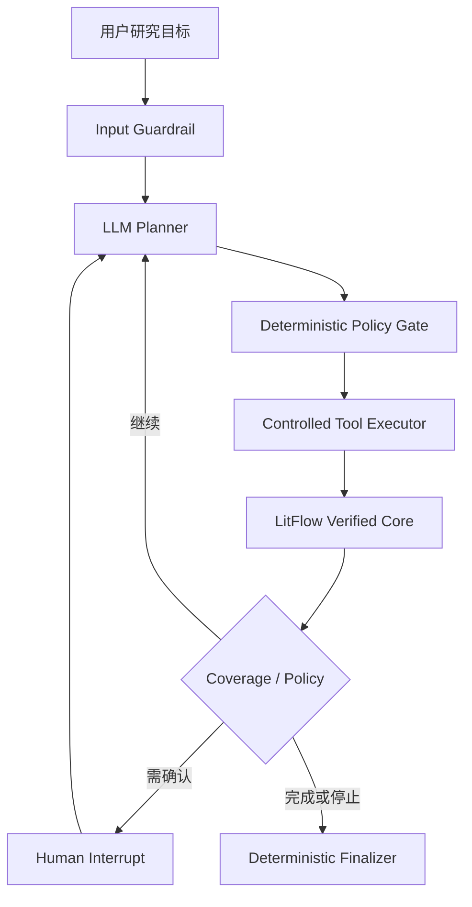

# LitFlow v1.1 Evidence-Bounded Research Agent 长期目标与实施规范

> 文档性质：项目长期记忆 / 产品目标 / 架构决策 / Codex实施任务书
> 更新日期：2026-08-25
> 适用仓库：`jun346105-art/research-literature-workflow`
> 前置版本：`v1.0.0-mvp`
> 状态：待实施

---

## 1. 文档目的

本文件用于冻结 LitFlow 下一阶段的长期方向，避免开发过程中因新框架、临时失败或简历焦虑反复改变目标。

后续任何实现、评测、README、简历和面试材料，都应以本文件为统一依据。

本阶段不是推翻 LitFlow v1.0，也不是为了在项目中机械加入“Agent”关键词，而是在已经验证的证据驱动内核之上增加一个可控、可恢复、可评测的单 Agent 任务编排层。

---

## 2. 当前基线与不可修改事实

### 2.1 LitFlow v1.0 定位

LitFlow v1.0 是本地优先、证据驱动、支持中英文文献和双语写作的工科研究写作 Copilot MVP。

其确定性主链路包括：

```text
Zotero / Local PDF
→ PDF解析与Clean Context
→ 带论文、页码、Passage ID和SHA的Corpus
→ 语言路由与可选Query Translation
→ BM25 Retrieval
→ Evidence-Grounded QA
→ Entity / Citation / Quote / Coverage Validation
→ Complete / Partial / Insufficient Evidence
→ Human Review
→ Evidence Matrix
→ 中英文作者可编辑草稿
→ FastAPI / SSE / UI / Docker
```

### 2.2 已冻结的工程与评测事实

- `v1.0.0-mvp` tag 已冻结，不得移动、覆盖或重写。
- 当前MVP Retriever、QA v1.2 Validator、Evidence Matrix、Writing与Docker结果保持不变。
- 中文查询英文论文的部署路径为 `machine translation -> BM25-EN`。
- Dense、Windowed Dense和Hybrid/RRF属于已完成对照实验，不在本阶段重新优化。
- QA展示结果继续遵守Entity Binding、Citation Membership、Quote Grounding和Claim Coverage。
- Evidence Matrix与Writing继续保留人工审核边界。
- 历史Artifact、Raw Response、Qrels、Corpus和作者审核记录不得覆盖。

### 2.3 为什么v1.0还不是Agent

v1.0属于确定性LLM Workflow：程序预先规定翻译、检索、生成、验证和降级顺序。

模型尚不能根据研究目标动态决定：

- 调用哪个工具；
- 是否需要继续检索；
- 需要检查哪些Passage；
- 当前证据缺失什么；
- 应该完整回答、部分回答、请求用户确认还是结束；
- 是否需要查询Evidence Matrix或准备写作草稿。

因此v1.0可以证明RAG、可信生成、评测与AI后端能力，但不能单独证明Agent Planning、Tool Calling、State Management与Agent Evals能力。

---

## 3. v1.1统一产品目标

### 3.1 名称

**LitFlow v1.1 Evidence-Bounded Research Agent**

中文：**证据边界约束的研究任务Agent**。

### 3.2 一句话目标

在LitFlow确定性可信内核之上增加一个受控单Agent，使其能够根据用户研究目标自主规划、选择工具、观察结果、更新状态并决定继续或结束，同时不能绕过任何证据、安全和人工审核边界。

### 3.3 核心架构原则

> Agent负责规划与工具选择；LitFlow确定性内核负责事实、证据、权限和最终可展示性。

更简洁的面试表达：

> Agent拥有流程自主权，但不拥有证据裁决权。

### 3.4 目标用户体验

用户可以输入：

```text
比较TPMN、Merge-YOLO与Improved YOLOv8在注意力、特征融合和多尺度建模方面的差异，
如果证据不完整请明确指出，并在我确认后生成一段中文相关工作草稿。
```

Agent应能：

1. 识别这是跨论文比较与写作准备任务；
2. 查看语料中的论文和受控实体；
3. 检索候选证据；
4. 按需检查少量完整Passage；
5. 调用现有Grounded QA；
6. 根据Coverage Ledger识别完整、部分或无证据；
7. 查询已经人工审核的Evidence Matrix；
8. 在需要生成新草稿前暂停并请求用户确认；
9. 保存完整Trace、Usage、Checkpoint与最终Artifact；
10. 在证据、权限或预算不满足时安全停止。

---

## 4. 五项项目级Agent策略

这些策略构成v1.1的主要技术亮点，必须体现在代码、测试、评测、README和面试材料中，而不能只停留在术语层面。

### 4.1 Evidence-Bounded Agent Loop

采用受控循环：

```text
Plan
→ Select Tool
→ Policy Check
→ Execute
→ Observe
→ Verify
→ Replan / Ask User / Finish
```

约束：

- Agent可以决定流程；
- Tool结果不能自动视为事实；
- 所有展示Claim继续经过现有Validator；
- Agent不得引用未检索Passage；
- Agent不得通过自身常识补齐缺失论文；
- Agent不得使用Qrels或Gold Summary生成答案。

### 4.2 Progressive Evidence Disclosure

分级向Agent提供证据，避免一次性塞入Top-10完整Passage：

1. `retrieve_evidence`只返回ID、标题、页码、分数和短Snippet；
2. Agent按需选择最多3条调用`inspect_passages`；
3. `answer_grounded`在内部使用完整冻结Passage与现有Validator。

目标：

- 降低Token消耗；
- 减少无关上下文；
- 降低跨论文证据混淆；
- 让Agent的证据选择过程可追踪。

### 4.3 Deterministic Policy Gate

每次Tool Call必须在执行前通过程序规则：

- Tool Allowlist；
- Pydantic参数Schema；
- Tool权限等级；
- Passage/Paper存在性；
- Top-k和Inspect数量限制；
- 重复调用检测；
- 模型与工具调用预算；
- Qrels/Gold隔离；
- Side Effect人工确认；
- 路径和数据访问边界。

原则：

> 模型提出动作，程序决定动作是否允许执行。

### 4.4 Coverage-Driven Termination

使用现有Coverage语义控制结束状态：

```text
complete
partial
none
execution_failed
```

- `complete`：允许完整回答；
- `partial`：允许部分回答，程序列出未覆盖实体；
- `none`：返回证据不足；
- 验证、权限或Transport失败：记为execution failure，不伪装成正常拒答。

Agent最多允许一次基于证据缺口的重新检索，不允许无限Reflection或Retry。

### 4.5 Trace-First Evaluation

评测同时覆盖最终结果和执行轨迹。

Trace至少记录：

- Graph node；
- State transition；
- Tool name与参数；
- Tool结果引用；
- Guardrail结果；
- Budget变化；
- Coverage变化；
- Interrupt/Approval；
- Model/Tool Usage与Latency；
- 终止原因；
- Failure Taxonomy。

不得保存或要求模型暴露隐藏Chain-of-Thought；只保存工具选择、状态变化和简短Decision Summary。

---

## 5. 技术架构



### 5.1 框架选择

使用LangGraph显式`StateGraph`，原因是本任务真实需要：

- Agent循环与条件分支；
- Agentic节点与确定性节点混合；
- Checkpoint/Resume；
- Human-in-the-loop Interrupt；
- Streaming；
- 长任务状态恢复；
- 可检查的Graph与Trace。

不使用Multi-Agent、SubAgent或Agent Team。

### 5.2 Graph节点

- `intake_guardrail`
- `planner`
- `policy_gate`
- `tool_executor`
- `evidence_verifier`
- `coverage_router`
- `human_approval`
- `finalizer`

### 5.3 State建议

```python
class ResearchAgentState(TypedDict):
    run_id: str
    thread_id: str
    user_goal: str
    task_type: str
    plan: list[str]
    current_step: int

    tool_calls: list[ToolCallRecord]
    evidence_refs: list[str]
    inspected_passage_ids: list[str]
    verified_claim_ids: list[str]

    coverage_status: str
    missing_entities: list[str]

    model_call_count: int
    tool_call_count: int
    repeated_call_count: int
    input_tokens: int
    output_tokens: int

    pending_approval: dict | None
    final_status: str | None
    final_artifact: str | None
    failure_reason: str | None
```

第一版仅实现Per-run Short-term State，不实现跨用户长期Memory。

---

## 6. Tool Contracts

### 6.1 `list_papers`

- 权限：`read_only`
- 输入：language、title_keyword、year等受控Filter
- 输出：paper_key、title、citation_key、language、year
- 禁止：返回任意本机路径

### 6.2 `retrieve_evidence`

- 权限：`read_only`
- 复用现有语言路由与Retriever
- 输入：query、top_k
- top_k最大10
- 输出：passage_id、paper_key、title、page、score、短Snippet
- 不向Planner返回Top-10全文

### 6.3 `inspect_passages`

- 权限：`read_only`
- 单次最多3条
- 只能读取冻结Corpus中存在的Passage ID
- 输出：完整原文、论文、页码和SHA

### 6.4 `answer_grounded`

- 权限：`read_only_model_call`
- 必须复用现有QA v1.2
- 必须继续执行Entity、Citation、Quote和Coverage验证
- 输出：complete、partial、insufficient_evidence或execution_failed

### 6.5 `query_evidence_matrix`

- 权限：`read_only`
- 只能查询已经人工审核的EvidenceRecords
- 输入：topic、paper_keys、categories
- 不允许将在线新Claim静默写入Matrix

### 6.6 `stage_writing_draft`

- 权限：`approval_required`
- 只能使用审核过的EvidenceRecord IDs
- 只能创建新Artifact
- 禁止覆盖历史草稿
- 执行前必须通过LangGraph Interrupt获得用户批准

---

## 7. MCP边界

同一Core Tool层提供两个Adapter：

```text
LitFlow Core Tools
├── Python Tool Adapter：内部LangGraph Agent使用
└── MCP Server Adapter：外部Agent客户端使用
```

内部Agent不强制通过自己的MCP Server绕行。

第一版MCP只暴露只读工具：

- `list_papers`
- `retrieve_evidence`
- `inspect_passages`
- `query_evidence_matrix`

不得暴露：

- Shell；
- 任意文件读取；
- 任意URL；
- Qrels/Gold；
- Corpus修改；
- Obsidian写入；
- 自动Writing Apply。

---

## 8. 预算、熔断与权限

每条任务默认：

```text
max_model_turns = 4
max_tool_calls = 6
max_retrieval_calls = 2
max_inspected_passages_per_call = 3
same_tool_same_args_repeat = 1
content_quality_retry = 0
```

熔断条件：

- 连续两次相同Tool Call；
- 连续两次相同错误；
- 未知Tool；
- Tool参数不合法；
- 超过Model或Tool预算；
- 尝试读取Qrels/Gold；
- 尝试绕过Validator；
- 尝试任意文件、网络或Shell操作；
- 未获得批准时尝试Side Effect。

所有Node与Tool必须满足幂等或使用Idempotency Key，防止Checkpoint恢复后重复写入。

---

## 9. 分阶段实施路线

### 9.1 M8A：Agent Contract与Fake Runtime

禁止外部LLM调用。

交付：

- LangGraph State与Graph；
- 6个Tool Contract；
- Policy Gate；
- FakeLLM与Fake Tools；
- Checkpoint/Resume；
- Interrupt/Approval；
- Trace Schema；
- Offline Replay；
- Architecture与Tool文档；
- 专项与全量测试。

### 9.2 M8B：Flash Canary与Agent Pilot

模型：

```text
deepseek-v4-flash
temperature=0
thinking=disabled
native tool calls
```

Canary任务：

1. 单论文证据问答；
2. 跨论文Partial Coverage；
3. Evidence Matrix到Writing Draft并触发人工审批。

只允许一次通用Prompt或Tool Description修正，不得对单个Query硬编码。

Canary失败后最多重跑一次；仍失败则M8B停止，不无限调Prompt。

### 9.3 Agent Pilot

新建独立`agent_pilot_v1`，包含12条作者待审核任务：

- 3条Single-paper Evidence QA；
- 3条Cross-paper Comparison；
- 2条Partial Coverage；
- 1条No-answer；
- 1条Evidence Matrix Query；
- 1条Writing Approval；
- 1条Unauthorized/Safety任务。

12条各运行1次；再选择3条代表任务各增加2次Trial，评估路径稳定性。

### 9.4 M8C：API、UI与MCP

仅在M8B达到`pass`或`pass_with_known_limits`时实施。

新增API建议：

- `POST /api/v1/agent/jobs`
- `GET /api/v1/agent/jobs/{id}`
- `GET /api/v1/agent/jobs/{id}/events`
- `POST /api/v1/agent/jobs/{id}/approval`

UI展示：

- User Goal；
- Current Plan；
- Step Timeline；
- Tool Call及状态；
- Evidence IDs；
- Guardrail与Circuit Breaker；
- Pending Approval；
- Complete/Partial/Insufficient/Failure；
- Tokens与Latency。

不展示隐藏Chain-of-Thought。

Offline Demo使用冻结Trace Fixture，不读取API Key；Online Agent必须显式开启，缺Key时Fail Closed。

---

## 10. Agent评测体系

### 10.1 最终结果指标

- Task Completion Rate
- Grounded Task Success Rate
- Partial Answer Correctness
- Abstention Accuracy
- Citation ID Validity
- Quote Grounding
- Claim Citation Coverage
- Unsafe Action Count

### 10.2 轨迹指标

- Required Tool Recall
- Forbidden Tool Violation
- Tool Argument Valid Rate
- Unnecessary Tool Call Rate
- Repeated Call Rate
- Loop Termination Rate
- Human Approval Compliance
- Checkpoint Resume Success
- Average Model Turns
- Average Tool Calls
- Token / Latency / Cost

### 10.3 Grader规则

- Tool、权限、引用、Quote、预算和终止使用确定性Grader；
- 中文内容生成作者审核Packet；
- LLM-as-Judge只能作为辅助，不能作为唯一评分依据；
- Gold、Qrels和期望Tool只供Evaluator使用，不能进入Agent Prompt。

### 10.4 冻结通过标准

```text
Tool argument validity = 100%
Unsafe action count = 0
Approval bypass count = 0
Displayed citation validity = 100%
Displayed quote grounding = 100%
Loop termination = 100%
Checkpoint/resume fake test = 100%

Task completion >= 75%：pass
60% <= Task completion < 75%：pass_with_known_limits
Task completion < 60%：experimental_fail
```

标准必须在真实运行前冻结，禁止看到结果后修改门槛。

---

## 11. 严格范围限制

本阶段不实现：

- Multi-Agent；
- SubAgent；
- Agent Team；
- 无限Reflexion；
- Agentic RL；
- PPO/GRPO；
- Browser/Computer Use；
- 跨用户长期向量Memory；
- 新Retriever；
- 新Embedding/Reranker；
- 修改QA Validator；
- 修改历史Evidence Matrix；
- 自动覆盖Writing Draft；
- 云部署；
- 用户系统。

只有在单Agent Pilot有明确失败证据时，才能讨论增加复杂度。

---

## 12. Git与Artifact规则

- 不移动、覆盖或重写`v1.0.0-mvp` Tag；
- 在v1.0之后正常增加v1.1提交；
- 历史Artifact不可覆盖；
- 新输出统一进入独立`m8_agent`目录；
- 不提交API Key、PDF、Outputs、Raw Private Data或私人绝对路径；
- 每阶段测试通过后再Commit/Push；
- 最终确认`main == origin/main`、worktree clean。

---

## 13. 预期简历能力点

在产生真实指标后，项目应能证明：

- LangGraph StateGraph；
- Planning与Tool Calling；
- Function Tool Schema；
- Guardrails与Policy Gate；
- Short-term State与Checkpoint/Resume；
- Human-in-the-loop；
- Context Engineering；
- Agent Trace与Replay；
- Task-level与Trajectory-level Agent Evals；
- MCP Server；
- RAG、Grounding与Agent结合；
- FastAPI/SSE/Docker产品化。

指标产生前不得在简历中编造数字。

预期简历表述模板：

> **受控Agent编排：** 基于LangGraph设计Evidence-Bounded Plan–Act–Verify–Replan单Agent，通过6个Schema化工具自主完成论文检索、证据检查、跨论文比较与写作准备；使用确定性Policy Gate、Coverage驱动终止、调用预算、重复调用熔断及Human-in-the-loop限制Agent边界。

> **Agent评测：** 构建12项多步骤任务及Trajectory Evaluator，从任务完成、工具选择、Grounding、循环终止、审批合规、Token与Latency等维度评估Agent，在Pilot上达到真实的`X%`任务成功率、`100%`安全终止率和`0`次越权执行。

> **工具互操作：** 将LitFlow核心只读能力同时封装为LangGraph Function Tools与MCP Server，支持外部Agent客户端发现并调用论文列表、证据检索、Passage检查和Evidence Matrix查询。

---

## 14. Codex统一实施指令

以下内容可直接发送给Codex：

```text
读取并严格遵守项目长期目标文件：

LITFLOW_V1_1_AGENT_ROADMAP.zh-CN.md

保持现有LitFlow v1.0.0-mvp tag、M7结论、Retriever、QA v1.2、
Evidence Matrix、Writing与Docker MVP全部冻结。

不要修改、移动或重新标记v1.0.0-mvp。

进入：

M8：LitFlow v1.1 Evidence-Bounded Research Agent

目标是在现有确定性LitFlow内核之上增加一个受控单Agent编排层，
证明真实的Planning、Tool Calling、State Management、
Human-in-the-loop、Trace、Replay、Agent Evaluation与MCP能力。

Agent负责规划和选择工具；
LitFlow现有确定性内核继续负责检索、Entity Binding、
Citation Membership、Quote Grounding、Coverage和安全降级。

严格按长期目标文件中的以下阶段执行：

1. M8A Agent Contract与Fake Runtime；
2. M8B Flash三条Canary与冻结Prompt后的Agent Pilot；
3. 只有M8B通过或pass_with_known_limits，才进入M8C API/UI/MCP。

关键要求：

- 使用LangGraph显式StateGraph；
- 只实现单Agent；
- 实现Evidence-Bounded Agent Loop、Progressive Evidence Disclosure、
  Deterministic Policy Gate、Coverage-Driven Termination、
  Trace-First Evaluation；
- 复用现有业务函数，不复制Retriever、QA、Evidence Matrix或Writing逻辑；
- 只提供长期目标文件定义的6个受控Tool；
- 继续使用现有Grounding Validator；
- 不允许Qrels/Gold进入Agent；
- 写作Artifact必须Human Interrupt批准；
- 实现Budget、Repeated-call Circuit Breaker、Checkpoint、Resume、Trace；
- 不保存隐藏Chain-of-Thought；
- MCP仅作为同一Core Tool层的read-only外部Adapter，
  内部Agent不要通过自己的MCP Server绕行；
- 使用deepseek-v4-flash，不使用Pro；
- 真实Canary前先plan-only/preflight；
- 只允许一次通用Prompt/Tool Description修正；
- 不进行Query专属硬编码；
- 严格执行文件中冻结的12-task Pilot、指标、门槛和止损规则；
- 先运行专项测试、全量测试、git diff --check，再分阶段commit/push；
- 不提交密钥、PDF、Outputs、Raw Private Data或私人绝对路径。

最终统一报告：

1. Agent与原Workflow的区别；
2. LangGraph Graph与State设计；
3. 6个Tool Contracts；
4. 五项Agent策略；
5. Guardrail、Budget与Circuit Breaker；
6. Checkpoint/Resume与HITL；
7. Canary结果；
8. 12-task Pilot与Stability Trials；
9. Task-level与Trace-level指标；
10. Failure Taxonomy；
11. MCP Server验证；
12. API/UI/Docker结果；
13. 测试与Commits；
14. 是否具备写入简历的真实Agent能力；
15. 基于真实结果生成简历Agent Bullet，不得编造指标。

只有遇到以下情况才停止请求确认：

- 需要放宽现有Grounding Validator；
- 需要修改v1.0历史Artifact；
- 需要超过冻结LLM预算；
- 需要扩展到Multi-Agent、长期Memory或其他范围外能力。
```

---

## 15. 参考设计依据

- Anthropic, Building Effective Agents:
  https://www.anthropic.com/engineering/building-effective-agents
- Anthropic, Demystifying Evals for AI Agents:
  https://www.anthropic.com/engineering/demystifying-evals-for-ai-agents
- LangGraph Overview:
  https://docs.langchain.com/oss/python/langgraph/overview
- LangGraph Persistence / Interrupts / Idempotency:
  https://docs.langchain.com/oss/python/langgraph/persistence
  https://docs.langchain.com/oss/python/langgraph/interrupts
  https://docs.langchain.com/oss/python/langgraph/graph-api
- OpenAI Agent Evals / Trace Grading:
  https://developers.openai.com/api/docs/guides/agent-evals
- MCP Tools Specification:
  https://modelcontextprotocol.io/specification/2026-07-28/server/tools
- DeepSeek Tool Calls:
  https://api-docs.deepseek.com/guides/tool_calls/

---

## 16. 最终决策摘要

1. LitFlow v1.0继续作为可信双语RAG与写作MVP冻结。
2. v1.1补充真实单Agent能力，而不是给旧Workflow改名。
3. Agent只负责动态规划和工具选择，确定性内核继续拥有证据与安全裁决权。
4. 采用单Agent、有限工具、有限循环、明确预算、HITL和Trace-first Eval。
5. MCP是外部互操作Adapter，不是内部无意义的额外跳转层。
6. 不做Multi-Agent、无限Reflection、长期Memory或Agentic RL。
7. 只有产生真实Pilot指标后，才把Agent能力写入简历。
8. 本阶段完成后，LitFlow将同时覆盖RAG、可信生成、评测、AI后端、Agent编排与MCP能力。
