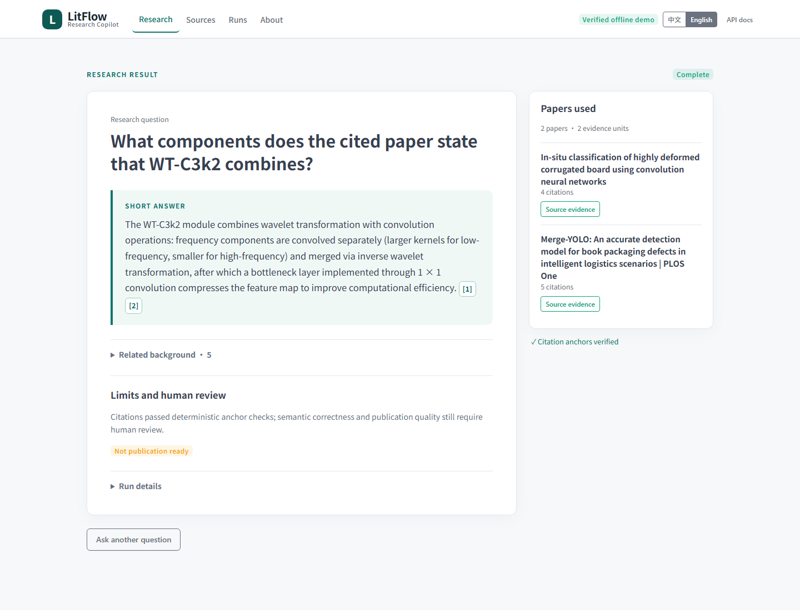
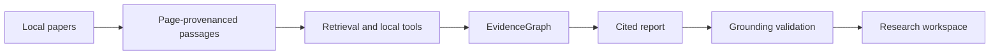

# LitFlow Research Copilot

[English](README.md) | [简体中文](README.zh-CN.md)

[](pyproject.toml) [](docs/API.md) [](https://github.com/jun346105-art/research-literature-workflow/actions/workflows/tests.yml)

> **From local scientific papers to research answers you can check against the source.**

LitFlow connects literature retrieval, evidence inspection and cited reports in a local research workspace.


## Why LitFlow

- **Follow a claim to its source.** Open a citation to inspect the paper, page, passage and supporting quote.
- **See where evidence runs out.** Partial results and evidence gaps help you decide what to read or verify next.
- **Revisit how a result was produced.** Saved artifacts, checkpoints and offline replay preserve the steps behind a report.

## A verifiable example

**Question:** What components does the cited paper state that WT-C3k2 combines?

**Recorded finding:** WT-C3k2 combines WTConv frequency processing with the C3k2 path and retains a 1 × 1-convolution bottleneck after feature fusion.

**Source:** *Merge-YOLO: An accurate detection model for book packaging defects in intelligent logistics scenarios*, page 6, passage `DZ6TYBIQ_chunk_0008`.

> “The bottleneck layer is implemented through 1 × 1 convolution, reducing the dimension of the feature map...”

Open the citation to compare the finding with its anchored quote and source context. See the [recorded single-paper result](docs/deep_research/REAL_SINGLE_PAPER_E2E_RESULT_V1.md).



With the local demo assets installed, frozen examples show complete reports; custom questions show local evidence retrieval. See the [Demo guide](docs/DEEPRESEARCH_DEMO.md) for setup and examples.

## Five-minute Quickstart

From the repository root, using Python 3.13:

**Windows PowerShell**

```powershell
py -3.13 -m venv .venv
.\.venv\Scripts\python.exe -m pip install -e .
.\scripts\start-demo.ps1
```

**Linux / macOS**

```bash
python3.13 -m venv .venv
.venv/bin/python -m pip install -e .
PYTHONPATH=src .venv/bin/python -m uvicorn litflow_api.app:app --host 127.0.0.1 --port 8015
```

Open <http://127.0.0.1:8015/>. The default Demo needs no API key and makes no Provider requests. Installation downloads Python dependencies; running the Demo is offline. Local corpus/run assets are required for data-backed interactions and are not distributed in the public checkout. See [local asset requirements](docs/DEEPRESEARCH_DEMO.md#local-demo-assets) and [troubleshooting](docs/TROUBLESHOOTING.md).

## How it works



The bounded report workflow uses a Planner, a local read-only Executor and a Writer. The program assigns evidence identities and validates citation membership and quote anchoring before displaying a report. [Explore the architecture](docs/deep_research/ARCHITECTURE.md).

## Evaluation highlights

R1 froze **32 development + 16 held-out queries** over a local scientific-literature corpus. BM25-EN was selected on development queries, then evaluated once on the held-out split.

| Held-out retrieval metric | Result |
|---|---:|
| Recall@10 | **84.0%** |
| nDCG@10 | **68.9%** |
| Answerable success@10 | **100%** |

These measure retrieval on the frozen corpus; answerable success means finding relevant evidence, not generating a correct answer. [View the full evaluation methodology and failure analysis](docs/evaluation/README.md).

## Engineering capabilities

- **Evidence workflow:** page-provenanced Zotero/PDF ingestion, BM25/Dense/Hybrid evaluation and deterministic citation validation.
- **Local application:** FastAPI jobs, SSE progress, persisted results and a responsive bilingual Tabler interface.
- **Provider integration:** capability-aware adapters, explicit Planner/Writer budgets, unified errors, bounded retry and zero-external-call replay. [Provider capabilities and recorded results](docs/providers/README.md).

## Privacy and reproducibility by design

Research inputs and run artifacts stay in your local workspace. The default Demo and replay work offline; optional model execution uses server-side environment credentials through the controlled CLI. Public result views use relative artifact locators and bounded evidence excerpts. Immutable run identities and checkpoints make the recorded process inspectable. [Privacy and execution details](docs/DEEPRESEARCH_DEMO.md#privacy-and-reproducibility).

## Documentation

| Start here | Go deeper |
|---|---|
| [Run the Demo](docs/DEEPRESEARCH_DEMO.md) | [Architecture](docs/deep_research/ARCHITECTURE.md) |
| [Inspect evidence](docs/EVIDENCE_GROUNDING.md) | [API reference](docs/API.md) |
| [Troubleshooting](docs/TROUBLESHOOTING.md) | [Evaluation](docs/evaluation/README.md) · [Providers](docs/providers/README.md) |
| [Scope and known issues](docs/DEEPRESEARCH_DEMO.md#scope-and-known-issues) | [All documentation](docs/README.md) |

The current version focuses on local scientific corpora, evidence retrieval and verifiable research reports; see the project documentation for the full scope and known issues.

## License status

A project-level license has not yet been selected. See [license status and third-party notices](docs/README.md#license-status); bundled Tabler assets retain their MIT license.
