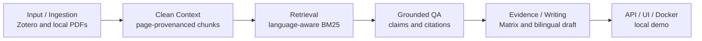

# LitFlow

[中文 README](README.zh-CN.md) | English

> **LitFlow is a local-first, evidence-grounded bilingual research writing copilot for engineering literature.**

It turns local literature artifacts into reviewable research material with passage-level provenance. It is not an automatic whole-paper generator or a hosted SaaS product.


## Why LitFlow

A general AI answer can sound plausible while losing the paper, page, passage, and quote that justify it. LitFlow keeps the researcher's local corpus in control:

- the model sees only retrieved passages for a question;
- every displayed claim carries a retrieved citation;
- citation membership, quote anchoring, and claim-citation coverage are validated before display;
- insufficient evidence and partial coverage remain visible instead of becoming unsupported prose;
- human review, raw response, usage, manifest, SHA, and failure artifacts remain auditable.

## Core Capabilities

1. **Local ingestion and clean context**: Zotero metadata and local PDFs become quality-gated, page-provenanced chunks.
2. **Language-aware retrieval**: Chinese queries use machine translation for English BM25 retrieval; English queries use their original wording.
3. **Evidence-grounded QA**: answers expose verified claims, citations, continuous English quotes, pages, passage IDs, partial coverage, and safe failure states.
4. **Evidence and writing views**: a review-ready Evidence Matrix feeds an author-editable bilingual method-comparison draft.
5. **Local delivery boundary**: FastAPI, SSE job status, a native browser workbench, persisted jobs, and a localhost-only Docker demo.

```text
Zotero / local PDF
-> Clean Context
-> Provenance Passage Corpus
-> Language-aware Retrieval
-> Evidence-grounded QA
-> Claim / Citation / Quote Validation
-> Evidence Matrix
-> Bilingual Author-editable Draft
-> FastAPI / SSE / UI
-> Docker Demo
```

## Docker Quick Start

The default command starts an **Offline Demo** on `127.0.0.1`. It mounts local demo artifacts read-only and does not need or read an API key.

```powershell
$env:LITFLOW_DEMO_INPUT_DIR = (Resolve-Path .\outputs)
docker compose up --build
```

Open `http://127.0.0.1:8015/`.

Online QA is an explicit opt-in profile and may incur provider charges. It is never enabled by the default command. See [Docker Demo](docs/DOCKER_DEMO.md).

## Human-Reviewed Pilot Results

These are **small human-reviewed pilot results, not a large-scale benchmark**.

| Area | Conservative result | Boundary |
| --- | --- | --- |
| Retrieval | 20 pilot queries, 17 answerable | `query_en` is an oracle-style reference only |
| Chinese retrieval | machine translation -> BM25-EN Recall@10 `0.7157` | BM25-ZH-raw Recall@10 `0.6275`; absolute improvement `+0.0882` |
| Mixed-language smoke | expected-paper Hit@10 `5/6` | one known Chinese-to-Chinese miss; not a broad benchmark |
| QA availability | grounded answer success `9/17` (`52.9%`) | retrieval and execution availability remain limited |
| Displayed QA safety | author-reviewed usability `9/9`; citation validity, strict quote grounding, and claim coverage `100%` | automatic grounding is not semantic correctness |
| No-answer handling | abstention `3/3` | limited pilot only |
| Writing | bilingual method-comparison draft `pass_with_moderate_human_revision` | `publication_ready=false` |
| Docker | image about `54.54 MB`; health in `1.20s`; health latency `142.04ms` | local Docker demonstration only |

## Architecture



## Demo Materials

- [Docker demo instructions](docs/DOCKER_DEMO.md)
- [3-5 minute demo script](docs/DEMO_SCRIPT.md)
- [Demo checklist](docs/DEMO_CHECKLIST.md)
- [Evidence Matrix screenshot](docs/screenshots/litflow-mvp-evidence-matrix.png)
- [Bilingual Writing Draft screenshot](docs/screenshots/litflow-mvp-writing-draft.png)

The workbench screenshot above restores a **persisted verified Q01 job**. It is not presented as a new real-time call.

## Known Limitations

- Local-first MVP only. No cloud deployment, user accounts, database, or multi-user workflow.
- No OCR for scanned PDFs and no automatic PDF download.
- `v0.3A` deep-reading object ingestion is an `experimental_fail`, not a production feature.
- Dense and Hybrid did not exceed the selected BM25 baseline in this bounded pilot.
- QA availability is limited: `9/17` answerable pilot queries produced grounded answers.
- Chinese source support is smoke-test level, not a broad multilingual benchmark.
- Writing output is author-editable and review-gated, never publication-ready by default.

## Documentation

- [Architecture](ARCHITECTURE.md)
- [API and local MVP](docs/API.md)
- [Evaluation Run 002](docs/EVALUATION_RUN_002.md)
- [Evidence grounding](docs/EVIDENCE_GROUNDING.md)
- [Interview guide](docs/INTERVIEW_GUIDE.zh-CN.md)
- [Resume project descriptions](docs/RESUME_PROJECT.en.md) and [中文版本](docs/RESUME_PROJECT.zh-CN.md)
- [Release notes](RELEASE_NOTES_v1.0.0.md)

## Development Check

```powershell
$env:PYTHONPATH = "src"
python -m pytest -q -p no:cacheprovider
```

Current suite: `238 passed`.
