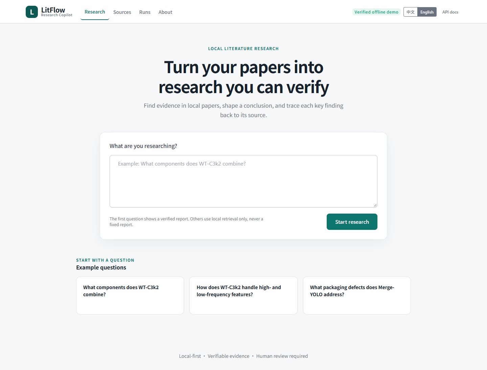
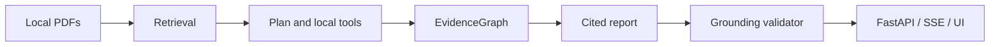

# LitFlow Research Copilot

[English](README.md) | [简体中文](README.zh-CN.md)

[](https://github.com/jun346105-art/research-literature-workflow/actions/workflows/tests.yml) [](pyproject.toml) [](docs/API.md) [](https://github.com/jun346105-art/research-literature-workflow/releases)

> **Turn a local scientific-literature corpus into research answers whose claims, citations and source passages can be inspected.**



## 1. Overview

LitFlow is a local-first research copilot for scientific literature. Unlike a generic document chat, it keeps retrieval, evidence, citations, validation and safe partial results visible to the researcher.

## 2. Demo

The key-free offline Demo shows one frozen, complete research report and local evidence retrieval for other questions. It never reuses the frozen report for an arbitrary query.

### A verifiable example

**Question:** What components does the cited paper state that WT-C3k2 combines?

**Conclusion:** WT-C3k2 combines WTConv frequency processing with the C3k2 path and retains a 1 × 1-convolution bottleneck after feature fusion.

**Citation:** *Merge-YOLO: An accurate detection model for book packaging defects in intelligent logistics scenarios*, page 6, passage `DZ6TYBIQ_chunk_0008`.

> “The bottleneck layer is implemented through 1 × 1 convolution, reducing the dimension of the feature map...”

The quote passed deterministic anchor validation. That proves traceability, not semantic correctness or publication quality.


The language switch changes the interface only; it does not translate frozen paper text. See the [Demo guide](docs/DEEPRESEARCH_DEMO.md).

## 3. Why LitFlow

- **Inspect the evidence:** open a citation to see its paper, page, passage ID and supporting quote.
- **Keep failures honest:** partial and insufficient-evidence states remain visible instead of becoming unsupported prose.
- **Reproduce the run:** immutable artifacts, checkpoints and zero-provider-call replay preserve how a result was produced.

## 4. Key Features

- Page-provenanced Zotero/PDF ingestion and BM25/Dense/Hybrid retrieval evaluation.
- Planner → local tools → EvidenceGraph → Writer → deterministic Validator.
- FastAPI jobs, SSE progress, persisted results and a responsive bilingual Tabler interface.

## 5. Five-Minute Offline Quickstart

Windows PowerShell:

```powershell
py -3.13 -m venv .venv
.\.venv\Scripts\python.exe -m pip install -e .
.\scripts\start-demo.ps1
```

Linux/macOS:

```bash
python3.13 -m venv .venv
.venv/bin/python -m pip install -e .
PYTHONPATH=src .venv/bin/python -m uvicorn litflow_api.app:app --host 127.0.0.1 --port 8015
```

Open `http://127.0.0.1:8015/`. The default path needs no API key and makes no Provider request. For troubleshooting and the offline job API, use the [Demo guide](docs/DEEPRESEARCH_DEMO.md).

## 6. How It Works



## 7. Architecture

The program owns IDs, evidence membership, quote anchoring, terminal state and artifact paths. Models can propose plans and prose, but cannot mark their own output grounded or publication-ready.

## 8. Evaluation

R1 uses a frozen corpus of 10 papers and 185 passages. BM25-EN was selected on 32 development queries; the 16-query held-out split was then run once and was not used for tuning.

| Metric | Result |
|---|---:|
| Development BM25-EN Recall@10 | 0.735294 |
| Held-out Recall@5 / @10 / @20 | 0.715278 / 0.840278 / 0.861111 |
| Held-out MRR@10 / nDCG@10 | 0.680556 / 0.688869 |
| Held-out answerable success@10 | 1.000000 |
| Held-out no-answer FP@10 | 1.000000 |
| Development no-answer FP@10 after threshold | 1.000000 → 0.800000 |

These are bounded-corpus retrieval results. The development-only threshold improved one negative case but was not independently validated on held-out data.

## 9. Provider Compatibility

| Provider | Recorded result | Boundary |
|---|---|---|
| GLM-5.3-Flash | Complete | Frozen workflow completed with grounded citations |
| DeepSeek | Writer truncated | Fixed 4096-token project budget conflicted with high-reasoning token usage |

This is not a model-quality ranking. The project now records explicit Planner/Writer budgets, capability profiles, normalized errors and bounded retries, but no selective successful rerun was used.

## 10. Reproducibility and Safety

- Browser/API clients cannot submit or read Provider keys.
- Replay performs zero Provider calls; existing artifacts are read-only by run identity.
- Real Provider execution is optional and requires a server-side environment key plus explicit run authorization.
- Public API responses use relative artifact locators and omit raw Provider responses and private absolute paths.

## 11. API

```text
POST /api/deep-research/jobs
GET  /api/deep-research/jobs/{job_id}
GET  /api/deep-research/jobs/{job_id}/result
GET  /api/deep-research/jobs/{job_id}/events   (SSE)
```

The Demo rejects `mode=online`. Real Provider execution remains behind the controlled CLI.

## 12. Project Structure

```text
src/litflow/deep_research/   contracts, runtime and grounding
src/litflow_api/             FastAPI, jobs, SSE and UI
docs/deep_research/          evaluation and engineering details
tests/                       offline contracts and regressions
```

## 13. Known Limitations

- Only exact frozen examples display complete reports; other questions currently return local retrieval evidence only.
- The language switch does not translate frozen paper passages.
- Traceable citations do not prove that a conclusion is correct or ready to publish; human review remains required.
- No account system, multi-tenant security, hosted cloud service or production deployment is included.
- No-answer handling remains incomplete, and the small frozen R1 corpus does not establish open-domain quality.
- The DeepSeek Writer truncation is a reliability result, not evidence that one model is better than another.

## 14. Documentation

**For users:** [Install and run the Demo](docs/DEEPRESEARCH_DEMO.md) · [Inspect evidence](docs/EVIDENCE_GROUNDING.md) · [Troubleshooting](docs/TROUBLESHOOTING.md) · [Privacy and safety](docs/DEEPRESEARCH_DEMO.md)

**For developers:** [System architecture](docs/deep_research/ARCHITECTURE.md) · [API](docs/API.md) · [Retrieval evaluation](docs/deep_research/retrieval_quality_r1/README.md) · [Provider adapter details](docs/deep_research/paired_e2e/README.md)

Detailed Evaluation / Reproducibility / Engineering records remain under [`docs/deep_research`](docs/deep_research/) and are intentionally not part of the user quick path.

## 15. Roadmap

Web retrieval, multimodal evidence, multi-agent orchestration, hosted deployment and broader benchmarks are future possibilities, not current capabilities.

## 16. License

No repository-level license is currently declared. Review licensing before redistribution; bundled Tabler assets retain their own MIT license.
