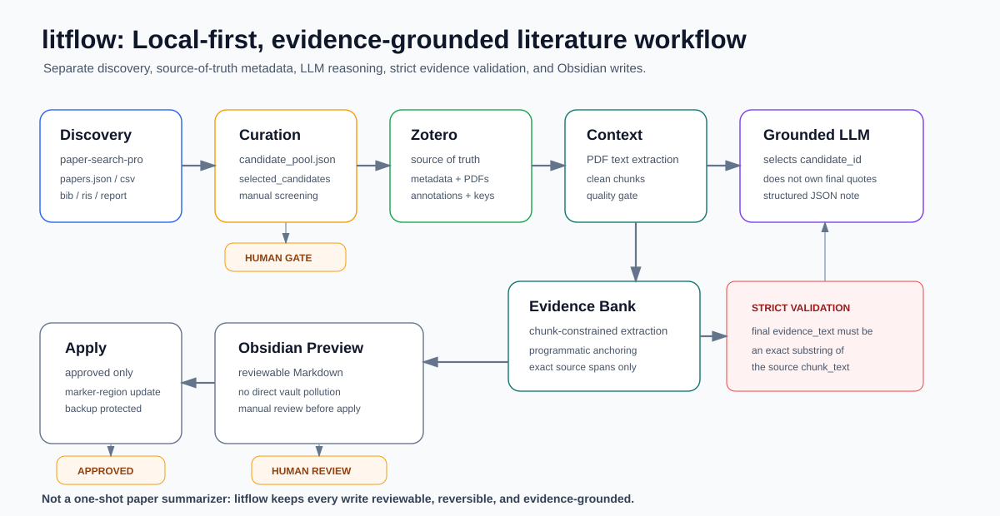

# Research Literature Workflow

[Chinese README](README.zh-CN.md) | English

Turn scattered papers into evidence-grounded Obsidian reading notes.



`litflow` is a local-first literature workflow for students and researchers who use Zotero, Obsidian, PDFs, and OpenAI-compatible LLMs. It is not another one-shot AI paper summarizer. It helps you build reusable, reviewable, source-grounded reading notes for long-running research projects.

## Why This Exists

Typical AI paper summarizers are fast, but they are weak at the parts that matter during thesis writing:

- bibliographic metadata drifts away from Zotero;
- evidence snippets are hard to trace back to the PDF;
- LLMs may normalize or rewrite quoted text;
- generated notes can pollute an Obsidian vault;
- one-off summaries do not become a reusable literature workflow.

`litflow` keeps the durable tools in charge:

- Zotero remains the source of truth for metadata, PDFs, annotations, and citation keys.
- Obsidian remains the local knowledge base.
- LLMs assist structured reading, but do not directly write final evidence text.
- Every final `evidence_text` must be an exact substring of a source chunk.
- Obsidian updates are preview-first, explicit, and backup-protected.

## Workflow

```text
paper-search-pro results
-> candidate_pool.json
-> manual selection
-> BibTeX / RIS export
-> user imports into Zotero
-> read-only Zotero snapshot
-> Obsidian inbox notes
-> PDF reading context
-> clean chunks + quality gate
-> evidence candidate bank
-> structured reading note
-> Obsidian preview
-> approved marker-region apply
```

## Try The Sample

The sample data is sanitized toy text. It does not require Zotero, real PDFs, an Obsidian vault, or an LLM API key.

```powershell
$env:PYTHONPATH = "src"

python -m litflow.cli preview-obsidian-update `
  --structured-note ".\examples\structured_reading_notes\SAMPLE001_structured_reading_note.json" `
  --vault ".\examples\obsidian_vault" `
  --inbox "00_Inbox/LiteratureReview" `
  --out ".\examples_output\SAMPLE001_preview.md" `
  --manifest ".\examples_output\SAMPLE001_preview_manifest.json"
```

Expected output: [examples/expected_outputs/SAMPLE001_preview.md](examples/expected_outputs/SAMPLE001_preview.md)

More steps: [docs/QUICKSTART.md](docs/QUICKSTART.md)

## What Makes It Different

### Evidence-grounded, not summary-only

The final evidence is not trusted just because the LLM wrote it. In the anchored pipeline, the model proposes quote hints or selects candidate IDs, and the program maps them back to source chunks.

Final validation is strict:

```python
evidence_text in chunk_text
```

### Designed around real student workflows

Many undergraduate and graduate students already use Zotero and Obsidian. `litflow` enhances that setup instead of replacing it.

It helps turn:

```text
"I remember reading something about this"
```

into:

```text
claim + source chunk + page range + exact evidence text + reviewable note
```

### Human-in-the-loop by default

Generated content is first written as structured JSON, then converted into a preview. Only an explicit `--approved` apply can update an Obsidian note, and a backup is created first.

## Core Commands

Anchored evidence path:

```powershell
python -m litflow.cli build-evidence-candidate-bank `
  --clean-context ".\outputs\clean_reading_context\PAPER.json" `
  --out ".\outputs\evidence_candidate_banks\PAPER_evidence_candidates.json" `
  --report ".\outputs\evidence_candidate_banks\PAPER_evidence_candidates_report.json"

python -m litflow.cli generate-note-from-evidence-bank `
  --candidate-bank ".\outputs\evidence_candidate_banks\PAPER_evidence_candidates.json" `
  --clean-context ".\outputs\clean_reading_context\PAPER.json" `
  --out ".\outputs\structured_reading_notes\PAPER_anchored_final.json" `
  --zotero-key "PAPER" `
  --citation-key "paper2026sample" `
  --title "Sample Paper Title"

python -m litflow.cli preview-obsidian-update `
  --structured-note ".\outputs\structured_reading_notes\PAPER_anchored_final.json" `
  --vault "<ObsidianVault>" `
  --inbox "00_Inbox/LiteratureReview" `
  --out ".\outputs\obsidian_update_previews\PAPER_preview.md" `
  --manifest ".\outputs\obsidian_update_preview_manifest.json"
```

Apply only after manual review:

```powershell
python -m litflow.cli apply-obsidian-update `
  --preview ".\outputs\obsidian_update_previews\PAPER_preview.md" `
  --target "<ObsidianVault>\00_Inbox\LiteratureReview\@paper2026sample.md" `
  --manifest ".\outputs\obsidian_update_apply_manifest.json" `
  --approved
```

## Documentation

- [Quickstart](docs/QUICKSTART.md)
- [Concepts](docs/CONCEPTS.md)
- [Troubleshooting](docs/TROUBLESHOOTING.md)
- [Minimal FastAPI wrapper](docs/API.md)
- [API demo with sample data](docs/API_DEMO.md)
- [Evaluation and acceptance metrics](docs/EVALUATION.md)
- [Architecture](ARCHITECTURE.md)
- [End-to-end workflow](docs/END_TO_END_WORKFLOW.md)
- [Project status](PROJECT_STATUS.md)
- [paper-search-pro local skill workflow](docs/PAPER_SEARCH_PRO_SKILL_WORKFLOW.md)
- [Sanitized examples](examples/README.md)

## Environment

Copy `.env.example` and fill only local values. Do not commit real keys.

```text
LLM_BASE_URL=
LLM_API_KEY=
LLM_MODEL=
ZOTERO_LIBRARY_ID=
ZOTERO_API_KEY=
OBSIDIAN_VAULT_PATH=
PAPER_SEARCH_PRO_RESULT_DIR=
```

## Current Status

- `v0.1-small-batch-e2e`: completed and tagged.
- `v0.1.1-anchored-evidence-pipeline`: anchored evidence pipeline and sanitized examples.
- Small-batch workflow validated with local Zotero, PDFs, Obsidian, and OpenAI-compatible LLM calls.
- Current test count: 101 passed.

## Limitations

- Local CLI workflow, not a hosted SaaS product.
- No OCR for scanned PDFs.
- No automatic PDF download.
- No automatic literature review generation.
- No automatic tag governance.
- No direct Zotero writes.
- No automatic Obsidian promotion into formal folders.
- Section detection is a lightweight heuristic.

## Development Check

```powershell
$env:PYTHONPATH='src;C:\Users\GigaByte\Documents\Codex\2026-07-01\obsidian\work\pydeps'
python -m pytest -q -p no:cacheprovider --basetemp ".\pytest_tmp_dev"
```
