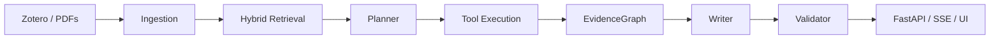

# LitFlow Research Copilot

[English](README.md) | [简体中文](README.zh-CN.md)

[](https://github.com/jun346105-art/research-literature-workflow/actions/workflows/tests.yml) [](pyproject.toml) [](docs/API.md) [](https://github.com/jun346105-art/releases)

> **A local-first, evidence-grounded DeepResearch copilot for scientific literature — from Zotero and PDFs to traceable plans, evidence, citations and research reports.**


**Evidence-grounded** · Claims stay linked to frozen source passages.<br>
**Reproducible by design** · Explicit contracts, immutable artifacts, checkpoints and replay.<br>
**Evaluated end to end** · Retrieval, abstention, grounding and real-provider canaries are recorded with scope limits.

## 1. Overview

LitFlow turns a local literature corpus into reviewable research material. It keeps the source, evidence, citation and validation boundary visible instead of presenting unsupported prose as fact.

## 2. Demo

The five-minute offline demo shows a submitted question, a structured plan, local evidence, grounded citations, validation and replay. It needs no API key and sends no external request.


The local UI uses pinned Tabler 1.4.0 assets (MIT; see the bundled license). The first example loads a frozen research run; the other example questions and arbitrary queries show local retrieval only. The report separates a direct answer from collapsed contextual claims. Open an inline citation to inspect its source quote; run IDs stay under Developer details. [Demo guide](docs/DEEPRESEARCH_DEMO.md).

```text
Question → Plan → EvidenceGraph → Cited report → Validator → terminal/replay
```

## 3. Why LitFlow

- Local papers remain the authority; retrieval is inspectable.
- Evidence quotes, locators and citations are validated before display.
- Partial results and insufficient evidence remain explicit.
- Human review and publication readiness are separate from structural grounding.

## 4. Key Features

- Zotero/PDF ingestion into page-provenanced passages.
- BM25 and bounded R1 retrieval evaluation with a development-only no-answer gate.
- Single-agent Planner → local read-only tools → EvidenceGraph → Writer → deterministic Validator.
- FastAPI jobs, SSE events, persisted artifacts and zero-call replay.
- GLM/DeepSeek capability profiles, explicit budgets and safe provider diagnostics.

## 5. Architecture



## 6. How It Works


The program owns formal IDs, evidence membership, quote anchoring, terminal state and artifact paths. Models only propose untrusted drafts.

## 7. Evaluation

R1 uses 10 papers and 185 passages: 32 development queries and one untouched 16-query held-out run. BM25-EN was selected using development only.

| Set / metric | Result |
|---|---:|
| Development BM25-EN Recall@10 | 0.735294 |
| Held-out Recall@5 / @10 / @20 | 0.715278 / 0.840278 / 0.861111 |
| Held-out MRR@10 / nDCG@10 | 0.680556 / 0.688869 |
| Held-out answerable success@10 | 1.000000 |
| Held-out no-answer FP@10 | 1.000000 |
| Round 4 development no-answer FP | 1.000000 → 0.800000 |

These are bounded frozen-corpus results, not open-domain or semantic-correctness claims. Held-out data was not used for tuning; no-answer detection remains incomplete.

## 8. Provider Compatibility

| Provider | Result | Finding |
|---|---|---|
| GLM-5.3-Flash | Complete | Frozen workflow completed with grounded citations |
| DeepSeek | Writer truncated | Fixed 4096-token budget was incompatible with high-reasoning token usage |

This is not a model-quality ranking. DeepSeek's official maximum output is not 4096; the failure exposed a fixed project Writer budget. Round 5 added explicit Planner/Writer budgets, capability profiles, an offline doctor and error classification. No selective successful rerun was used.

## 9. Five-Minute Offline Quickstart

Windows PowerShell:

```powershell
.\scripts\start-demo.ps1
```

Linux/macOS:

```bash
PYTHONPATH=src python -m uvicorn litflow_api.app:app --host 127.0.0.1 --port 8015
```

Open `http://127.0.0.1:8015/`, or call the offline job API:

```powershell
$job = Invoke-RestMethod http://127.0.0.1:8015/api/deep-research/jobs -Method Post -ContentType 'application/json' -Body '{"query":"Explain the frozen demo result"}'
Invoke-RestMethod "http://127.0.0.1:8015/api/deep-research/jobs/$($job.job_id)/result"
```

Docker alternative: see [Docker Demo](docs/DOCKER_DEMO.md).

Manual troubleshooting command: `$env:PYTHONPATH = "src"; .\.venv\Scripts\python.exe -m uvicorn litflow_api.app:app --host 127.0.0.1 --port 8015`.

## 10. API

```text
POST /api/deep-research/jobs
GET  /api/deep-research/jobs/{job_id}
GET  /api/deep-research/jobs/{job_id}/result
GET  /api/deep-research/jobs/{job_id}/events   (SSE)
```

The existing `/api/v1/*` MVP QA routes remain available. `mode=online` is explicitly rejected by the demo facade; real Provider execution stays behind the controlled CLI.

## 11. Project Structure

```text
src/litflow/deep_research/   contracts, runtime, retrieval, grounding
src/litflow_api/             FastAPI, job persistence, SSE and UI
docs/deep_research/          architecture, evaluation and audit evidence
outputs/                     local artifacts and frozen demo inputs
tests/                       offline contracts and regression coverage
```

## 12. Reproducibility and Safety

- Default Demo is offline and key-free.
- Artifacts are immutable by run identity and replay does not call Providers.
- Keys are process-local only; they are not logged, hashed or persisted.
- API paths expose relative artifact locators, never private absolute paths or raw responses.
- `publication_ready=false` and `author_review_required=true` remain conservative defaults.

## 13. Known Limitations

- Local-first single-machine product; no accounts, cloud deployment or multi-user security.
- Semantic correctness and publication quality are not automatically verified.
- Web, multimodal, Multi-Agent, Critic and long-task reliability are not validated.
- DeepSeek paired run is a known Writer truncation case, so no quality comparison is claimed.
- Docker build requires a running Docker Desktop daemon.

## 14. Documentation

[DeepResearch Demo](docs/DEEPRESEARCH_DEMO.md) · [Architecture](docs/deep_research/ARCHITECTURE.md) · [R1 Result](docs/deep_research/retrieval_quality_r1/R1_RESULT.md) · [Round 5 Provider Closure](docs/deep_research/paired_e2e/ROUND5_PROVIDER_CLOSURE.md) · [Docker Demo](docs/DOCKER_DEMO.md) · [Release notes](RELEASE_NOTES_v1.2.0.md) · [Interview Guide](docs/INTERVIEW_GUIDE.zh-CN.md) · [Resume Description](docs/RESUME_PROJECT.en.md)

## 15. Roadmap

Round 6 is the current local API/demo release. Web retrieval, multimodal evidence, Multi-Agent orchestration, public deployment and broader benchmark work remain explicitly deferred.

## 16. License

No repository license file is currently declared; review licensing before redistribution.
