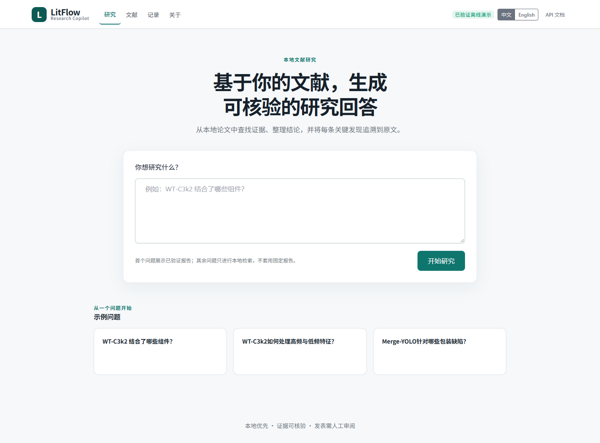
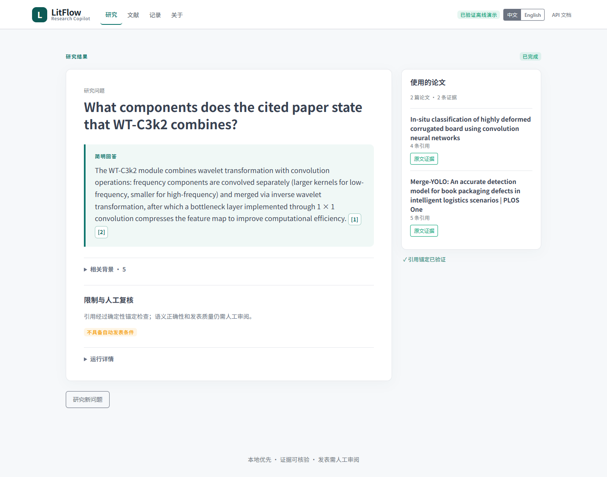
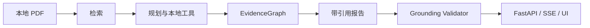

# LitFlow Research Copilot

[English](README.md) | [简体中文](README.zh-CN.md)

[](pyproject.toml) [](docs/API.md)

> **把本地科研文献转化为可核验的研究回答，让 Claim、Citation 与原文 Passage 保持可追溯。**



## 1. 概览

LitFlow 是面向科研文献的本地优先 Research Copilot。与普通文档聊天不同，它把检索、证据、引用、验证以及安全的部分结果持续展示给研究者。

## 2. 演示

默认离线 Demo 无需 Key：一个冻结示例展示完整研究报告，其他问题仅展示本地证据检索，不会复用固定答案。

### 一个可核验示例

**问题：** 论文指出 WT-C3k2 结合了哪些组件？

**结论：** WT-C3k2 结合 WTConv 的频率处理与 C3k2 路径，并在特征融合后保留通过 1 × 1 卷积实现的 bottleneck。

**引用：** *Merge-YOLO: An accurate detection model for book packaging defects in intelligent logistics scenarios*，第 6 页，passage `DZ6TYBIQ_chunk_0008`。

> “The bottleneck layer is implemented through 1 × 1 convolution, reducing the dimension of the feature map...”

该原句通过了确定性锚定验证。这证明引用可追溯，不代表语义自动正确或可以直接发表。



语言切换只改变界面，不会自动翻译冻结论文原文。详见[五分钟 Demo](docs/DEEPRESEARCH_DEMO.md)。

## 3. 为什么是 LitFlow

- **检查证据：** 打开引用即可查看论文、页码、passage ID 与支持原句。
- **如实呈现失败：** 部分结果与证据不足保持显式，不被包装为无依据结论。
- **复现运行过程：** 不可变 artifact、checkpoint 与零 Provider 调用 replay 保留结果来源。

## 4. 核心能力

- Zotero/PDF 摄取为带页码溯源的 passages，并评测 BM25、Dense 与 Hybrid 检索。
- Planner → 本地工具 → EvidenceGraph → Writer → 确定性 Validator。
- FastAPI jobs、SSE 进度、持久化结果与响应式中英文 Tabler 界面。

## 5. 五分钟离线 Quickstart

Windows PowerShell：

```powershell
py -3.13 -m venv .venv
.\.venv\Scripts\python.exe -m pip install -e .
.\scripts\start-demo.ps1
```

Linux/macOS：

```bash
python3.13 -m venv .venv
.venv/bin/python -m pip install -e .
PYTHONPATH=src .venv/bin/python -m uvicorn litflow_api.app:app --host 127.0.0.1 --port 8015
```

打开 `http://127.0.0.1:8015/`。默认路径无需 API Key，也不会调用 Provider。排障和离线 job API 见[五分钟 Demo](docs/DEEPRESEARCH_DEMO.md)。

## 6. 工作方式



## 7. 系统架构

程序拥有正式 ID、Evidence 归属、quote 锚定、终态和 artifact 路径。模型可以提出计划和草案，但不能自行把输出标记为已 grounding 或可发表。

## 8. 评测

R1 使用冻结的 10 篇论文和 185 个 passages。BM25-EN 仅由 32 条 development query 选出；16 条 held-out 随后只运行一次，未参与调参。

| 指标 | 结果 |
|---|---:|
| Development BM25-EN Recall@10 | 0.735294 |
| Held-out Recall@5 / @10 / @20 | 0.715278 / 0.840278 / 0.861111 |
| Held-out MRR@10 / nDCG@10 | 0.680556 / 0.688869 |
| Held-out answerable success@10 | 1.000000 |
| Held-out no-answer FP@10 | 1.000000 |
| Development no-answer threshold 后 FP@10 | 1.000000 → 0.800000 |

这些是受限语料检索结果。仅在 development 上校准的 threshold 改善了一个负例，但尚未在 held-out 上独立验证。

## 9. Provider 兼容性

| Provider | 已记录结果 | 边界 |
|---|---|---|
| GLM-5.3-Flash | Complete | 冻结工作流完成并通过引用 grounding |
| DeepSeek | Writer 截断 | 项目固定 4096-token 预算与高推理 token 消耗不兼容 |

这不是模型质量排名。项目目前记录显式 Planner/Writer 预算、能力画像、统一错误和有限重试，但没有通过选择性重跑制造成功结果。

## 10. 可复现性与安全

- 浏览器和 API 不能提交或读取 Provider Key。
- Replay 的 Provider 调用为 0；已有 artifact 按 run identity 只读。
- 真实 Provider 执行为可选模式，需要服务端环境变量与显式 run 授权。
- 公共 API 仅返回相对 artifact 定位，不返回原始 Provider 响应或私人绝对路径。

## 11. API

```text
POST /api/deep-research/jobs
GET  /api/deep-research/jobs/{job_id}
GET  /api/deep-research/jobs/{job_id}/result
GET  /api/deep-research/jobs/{job_id}/events   (SSE)
```

Demo 会拒绝 `mode=online`；真实 Provider 执行仍位于受控 CLI 后方。

## 12. 项目结构

```text
src/litflow/deep_research/   合同、Runtime 与 grounding
src/litflow_api/             FastAPI、jobs、SSE 与 UI
docs/deep_research/          评测与工程细节
tests/                       离线合同与回归测试
```

## 13. 已知限制

- 只有精确匹配的冻结示例展示完整报告；其他问题目前只返回本地检索证据。
- 语言切换不会翻译冻结论文 passage。
- 引用可追溯不代表结论自动正确或可直接发表，仍需人工审核。
- 不包含账号、多租户安全、托管云服务或生产部署。
- No-answer 仍未彻底解决，小规模冻结 R1 不能代表开放域质量。
- DeepSeek Writer 截断属于可靠性结果，不能据此声称某个模型更好。

## 14. 文档

**普通用户：** [安装并启动 Demo](docs/DEEPRESEARCH_DEMO.md) · [查看引用证据](docs/EVIDENCE_GROUNDING.zh-CN.md) · [常见排障](docs/TROUBLESHOOTING.md) · [隐私与安全](docs/DEEPRESEARCH_DEMO.md)

**开发者：** [系统架构](docs/deep_research/ARCHITECTURE.md) · [API](docs/API.md) · [检索评测](docs/deep_research/retrieval_quality_r1/README.md) · [Provider Adapter](docs/deep_research/paired_e2e/README.md)

详细 Evaluation / Reproducibility / Engineering 记录保留在 [`docs/deep_research`](docs/deep_research/) 中，但不进入普通用户快速路径。

## 15. 路线图

Web 检索、多模态证据、多 Agent 编排、托管部署和更大规模 benchmark 仅作为未来方向，不是当前能力。

## 16. License

仓库当前未声明项目级 License。再分发前需确认许可；随项目提供的 Tabler 静态资源保留其 MIT 许可证。
