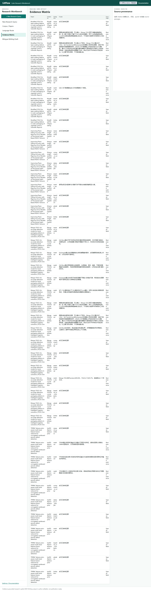
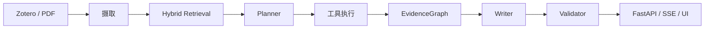

# LitFlow Research Copilot

[English](README.md) | [简体中文](README.zh-CN.md)

[](https://github.com/jun346105-art/research-literature-workflow/actions/workflows/tests.yml) [](pyproject.toml) [](docs/API.md) [](https://github.com/jun346105-art/releases)

> **面向科研文献的本地优先、证据驱动 DeepResearch Copilot：将 Zotero 与 PDF 转化为可追溯的研究计划、证据、引用和研究报告。**


**证据驱动** · 主要 Claim 均可追溯到冻结的原文 passage。<br>
**可复现设计** · 显式合同、不可变 artifact、checkpoint 与 replay。<br>
**端到端验证** · 检索、拒答、grounding 与真实 Provider Canary 均保留范围边界。

## 1. 概览

LitFlow 将本地文献语料转化为可审核研究材料。系统保持 Source、Evidence、Citation 和 Validator 的边界可见，不把未经支持的文字当作事实展示。

## 2. 演示

五分钟离线 Demo 展示问题输入、结构化计划、本地证据、带引用报告、验证和 replay。无需 API Key，也不会发送外部请求。



```text
问题 → 计划 → EvidenceGraph → 带引用报告 → Validator → 终态/replay
```

## 3. 为什么是 LitFlow

- 本地论文保持权威，检索过程可检查。
- 展示前验证 evidence quote、locator 与 citation。
- 部分结果与证据不足保持显式。
- 人工审核和发表质量与结构化 grounding 分开。

## 4. 核心能力

- Zotero/PDF 摄取为带页码溯源的 passages。
- BM25 与有界 R1 检索评测，以及仅在 development 校准的 no-answer gate。
- 单 Agent：Planner → 本地只读工具 → EvidenceGraph → Writer → 确定性 Validator。
- FastAPI jobs、SSE 事件、持久化 artifact 与零外部调用 replay。
- GLM/DeepSeek 能力画像、显式预算和安全 Provider 诊断。

## 5. 系统架构



## 6. 工作方式


程序拥有正式 ID、Evidence 归属、quote 锚定、终态和 artifact 路径；模型只提出不可信草案。

## 7. 评测

R1 使用 10 篇论文、185 个 passages：32 条 development query，以及一次未参与调参的 16 条 held-out 运行。最终选择 BM25-EN。

| 数据集 / 指标 | 结果 |
|---|---:|
| Development BM25-EN Recall@10 | 0.735294 |
| Held-out Recall@5 / @10 / @20 | 0.715278 / 0.840278 / 0.861111 |
| Held-out MRR@10 / nDCG@10 | 0.680556 / 0.688869 |
| Held-out answerable success@10 | 1.000000 |
| Held-out no-answer FP@10 | 1.000000 |
| Round 4 development no-answer FP | 1.000000 → 0.800000 |

这是受限冻结语料结果，不是开放域或语义正确性结论。held-out 未用于调参；no-answer 仍未彻底解决。

## 8. Provider 兼容性

| Provider | 结果 | 发现 |
|---|---|---|
| GLM-5.3-Flash | Complete | 在冻结任务上完成并通过 grounding |
| DeepSeek | Writer 截断 | 固定 4096 token 预算与高推理 token 消耗不兼容 |

这不是模型质量排名。DeepSeek 官方最大输出并非 4096；问题来自项目固定 Writer 预算。Round 5 已加入显式 Planner/Writer 预算、能力画像、离线 doctor 和错误分类，没有选择性重跑。

## 9. 五分钟离线 Quickstart

Windows PowerShell：

```powershell
$env:PYTHONPATH = "src"
python -m uvicorn litflow_api.app:app --host 127.0.0.1 --port 8015
```

Linux/macOS：

```bash
PYTHONPATH=src python -m uvicorn litflow_api.app:app --host 127.0.0.1 --port 8015
```

打开 `http://127.0.0.1:8015/`，或调用离线 job API：

```powershell
$job = Invoke-RestMethod http://127.0.0.1:8015/api/deep-research/jobs -Method Post -ContentType 'application/json' -Body '{"query":"Explain the frozen demo result"}'
Invoke-RestMethod "http://127.0.0.1:8015/api/deep-research/jobs/$($job.job_id)/result"
```

Docker 方式见 [Docker 演示说明](docs/DOCKER_DEMO.md)。

## 10. API

```text
POST /api/deep-research/jobs
GET  /api/deep-research/jobs/{job_id}
GET  /api/deep-research/jobs/{job_id}/result
GET  /api/deep-research/jobs/{job_id}/events   (SSE)
```

现有 `/api/v1/*` MVP QA 路由继续保留。Demo facade 会明确拒绝 `mode=online`；真实 Provider 仍只能通过受控 CLI。

## 11. 项目结构

```text
src/litflow/deep_research/   合同、Runtime、检索、grounding
src/litflow_api/             FastAPI、job 持久化、SSE 与 UI
docs/deep_research/          架构、评测和审计证据
outputs/                     本地 artifact 与冻结 Demo 输入
tests/                       离线合同与回归测试
```

## 12. 可复现性与安全

- 默认 Demo 离线且不需要 Key。
- Artifact 按 run identity 不可覆盖，replay 不调用 Provider。
- Key 只存在于进程，不记录、不哈希、不持久化。
- API 只暴露相对 artifact 定位，不返回私人绝对路径或原始响应。
- `publication_ready=false`、`author_review_required=true` 保持保守默认。

## 13. 已知限制

- 本地优先单机产品，不含账号、云部署或多用户安全。
- 语义正确性与发表质量不会被自动证明。
- Web、多模态、多 Agent、Critic 和长任务稳定性尚未验证。
- DeepSeek 配对运行是 Writer 截断已知失败，不能据此比较模型质量。
- Docker 构建需要运行中的 Docker Desktop daemon。

## 14. 文档

[DeepResearch Demo](docs/DEEPRESEARCH_DEMO.md) · [架构](docs/deep_research/ARCHITECTURE.md) · [R1 结果](docs/deep_research/retrieval_quality_r1/R1_RESULT.md) · [Round 5 Provider Closure](docs/deep_research/paired_e2e/ROUND5_PROVIDER_CLOSURE.md) · [Docker 演示](docs/DOCKER_DEMO.md) · [Release notes](RELEASE_NOTES_v1.2.0.md) · [面试指南](docs/INTERVIEW_GUIDE.zh-CN.md) · [简历描述](docs/RESUME_PROJECT.zh-CN.md)

## 15. 路线图

Round 6 是当前本地 API/Demo 封版。Web 检索、多模态证据、多 Agent 编排、公开部署和更大规模 benchmark 均明确延期。

## 16. License

仓库当前未声明 license 文件；对外再分发前请先确认许可。
