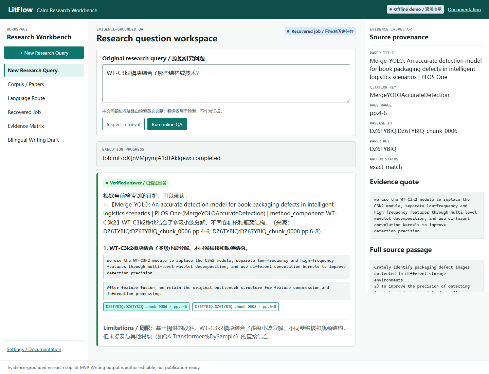
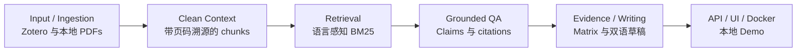

# LitFlow

中文 | [English README](README.md)

> **LitFlow是面向工科文献的本地优先、证据驱动、双语研究写作Copilot。**

它把本地文献材料转化为带 passage 级溯源的可审核研究素材。它不是自动整篇论文生成器，也不是线上 SaaS 产品。



## LitFlow 解决什么问题

通用 AI 的回答可能看似合理，却丢失支撑它的论文、页码、passage 和原文 quote。LitFlow 将控制权留在研究者的本地语料中：

- 模型只能看到当前问题检索到的 passages；
- 每条展示 Claim 都绑定检索到的 citation；
- citation membership、quote anchor 与 claim-citation coverage 在展示前严格验证；
- 证据不足与部分覆盖会保留，而不会转换成无证据结论；
- 人工审核、原始响应、usage、manifest、SHA 与失败 artifact 可审计。

## 五项核心能力

1. **本地输入与 Clean Context**：Zotero 元数据和本地 PDF 生成带页码溯源、经过质量门的 chunks。
2. **语言感知检索**：中文问题经机器翻译后检索英文 BM25；英文问题保留原始措辞。
3. **证据驱动 QA**：展示已验证 Claims、citations、连续英文 quote、页码、passage ID、部分覆盖和安全失败状态。
4. **Evidence 与 Writing 视图**：review-ready Evidence Matrix 支撑作者可编辑的双语方法比较草稿。
5. **本地交付边界**：FastAPI、SSE job 状态、原生浏览器工作台、持久化 jobs 与仅绑定 localhost 的 Docker Demo。

```text
Zotero / 本地 PDF
-> Clean Context
-> Provenance Passage Corpus
-> Language-aware Retrieval
-> Evidence-grounded QA
-> Claim / Citation / Quote Validation
-> Evidence Matrix
-> Bilingual Author-editable Draft
-> FastAPI / SSE / UI
-> Docker Demo
```

## Docker 快速启动

默认命令启动 **Offline Demo**，仅绑定 `127.0.0.1`。它以只读方式挂载本地 demo artifacts，不需要也不会读取 API key。

```powershell
$env:LITFLOW_DEMO_INPUT_DIR = (Resolve-Path .\outputs)
docker compose up --build
```

打开 `http://127.0.0.1:8015/`。

Online QA 必须显式启用 profile，且可能产生 provider 费用。默认命令不会启用它。详见 [Docker 演示说明](docs/DOCKER_DEMO.md)。

## 人工审核 Pilot 指标

以下均为**小规模 human-reviewed pilot，不是大规模 benchmark**。

| 领域 | 保守结果 | 边界 |
| --- | --- | --- |
| Retrieval | 20 条 pilot query，其中 17 条 answerable | `query_en` 只能作为 oracle-style reference |
| 中文检索 | machine translation -> BM25-EN Recall@10 `0.7157` | BM25-ZH-raw Recall@10 `0.6275`，绝对提升 `+0.0882` |
| Mixed-language smoke | expected-paper Hit@10 `5/6` | 中文->中文存在 1 条 known miss，不是广泛 benchmark |
| QA 可用性 | grounded answer success `9/17` (`52.9%`) | retrieval 与 execution availability 仍有限 |
| 展示 QA 安全性 | 作者审核 usability `9/9`；citation validity、strict quote grounding、claim coverage 均为 `100%` | 自动 grounding 不等于语义正确 |
| No-answer | abstention `3/3` | 仅限 pilot |
| Writing | 双语方法比较草稿 `pass_with_moderate_human_revision` | `publication_ready=false` |
| Docker | image 约 `54.54 MB`；health 就绪 `1.20s`；health latency `142.04ms` | 仅限本地 Docker 演示 |

## 架构



## 演示材料

- [Docker 演示说明](docs/DOCKER_DEMO.md)
- [3-5 分钟演示脚本](docs/DEMO_SCRIPT.md)
- [Demo Checklist](docs/DEMO_CHECKLIST.md)
- [Evidence Matrix 截图](docs/screenshots/litflow-mvp-evidence-matrix.png)
- [双语 Writing Draft 截图](docs/screenshots/litflow-mvp-writing-draft.png)

首图展示的是**持久化已验证 Q01 job 的恢复**，不宣称它是新的实时调用。

## 已知限制

- 当前是本地优先 MVP，不含云部署、用户系统、数据库或多用户协作。
- 不支持扫描版 PDF OCR，也不自动下载 PDF。
- `v0.3A` 方法精读对象抽取为 `experimental_fail`，不是生产能力。
- Dense 和 Hybrid 在当前受限 pilot 中未超过选定的 BM25 baseline。
- QA availability 有限：17 条 answerable pilot query 只有 9 条产生 grounded answer。
- 中文原生语料支持仍是 smoke-test 级，不是广泛多语言 benchmark。
- Writing 输出为作者可编辑、人工审核门控的草稿，不默认视为可发表稿件。

## 文档

- [架构](ARCHITECTURE.md)
- [API 与本地 MVP](docs/API.md)
- [Evaluation Run 002](docs/EVALUATION_RUN_002.zh-CN.md)
- [证据锚定](docs/EVIDENCE_GROUNDING.zh-CN.md)
- [面试讲解指南](docs/INTERVIEW_GUIDE.zh-CN.md)
- [简历项目描述](docs/RESUME_PROJECT.zh-CN.md) 与 [English version](docs/RESUME_PROJECT.en.md)
- [Release Notes](RELEASE_NOTES_v1.0.0.md)

## 开发检查

```powershell
$env:PYTHONPATH = "src"
python -m pytest -q -p no:cacheprovider
```

当前测试：`238 passed`。
