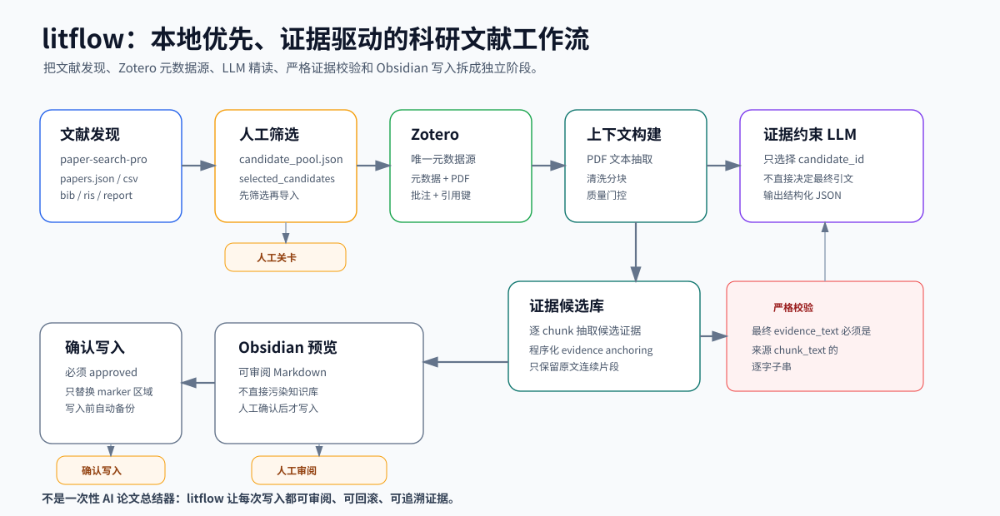

# Research Literature Workflow

中文 | [English](README.md)

把零散论文变成可追溯、可复用的 Obsidian 精读笔记。



`litflow` 是一个本地优先的科研文献工作流工具，面向使用 Zotero、Obsidian、PDF 和兼容 OpenAI API 大模型的本科生、研究生和科研初学者。它不是一次性的 AI 论文总结器，而是帮助你把文献检索、筛选、精读、证据追溯和 Obsidian 笔记沉淀串成一个可持续复用的流程。

## 它解决什么问题？

写毕业论文、开题报告或文献综述时，难点通常不是“让 AI 总结一篇论文”，而是把文献发现、PDF 阅读、证据定位和可复用笔记连成一条可信链。

普通流程经常是：

```text
检索论文
-> 保存一些 PDF
-> 让 LLM 总结
-> 把看起来有用的内容复制到笔记
-> 过一段时间忘了这个结论来自哪里
```

`litflow` 希望把它变成：

```text
Zotero 元数据 + 本地 PDF
-> chunked reading context
-> evidence candidate bank
-> structured reading note
-> Obsidian preview
-> 人工确认后再写入
```

它适合需要长期积累文献素材的学生：每条重要结论不仅有中文精读说明，还能追溯到来源 chunk、页码范围和逐字原文证据。

## 为什么需要这个项目

普通 AI 论文总结器很快，但在论文写作和长期文献管理中有几个问题：

- 文献元数据容易和 Zotero 脱节；
- AI 给出的证据很难追溯回 PDF 原文；
- LLM 可能会把 PDF 原文“整理干净”，导致引用片段不再是逐字原文；
- AI 生成内容如果直接写入 Obsidian，容易污染长期知识库；
- 一次性总结很难沉淀成后续开题、综述和论文写作可复用的素材。

`litflow` 的设计是让原有工具继续各司其职：

- Zotero 仍然是文献元数据、PDF、批注和 citation key 的唯一可信来源；
- Obsidian 仍然是本地 Markdown 知识库；
- LLM 只做结构化精读辅助，不直接决定最终证据文本；
- 最终 `evidence_text` 必须是 source chunk 的逐字子串；
- 写入 Obsidian 之前必须先 preview，人工确认后才允许 apply，并且 apply 前会自动 backup。

## 工作流

```text
paper-search-pro 检索结果
-> candidate_pool.json
-> 人工筛选
-> BibTeX / RIS 导出
-> 用户手动导入 Zotero
-> 只读 Zotero snapshot
-> Obsidian inbox 笔记
-> PDF reading context
-> clean chunks + quality gate
-> evidence candidate bank
-> structured reading note
-> Obsidian preview
-> approved marker-region apply
```

## 快速试用 Sample

sample 数据是脱敏 toy text，不需要 Zotero、真实 PDF、真实 Obsidian vault 或 LLM API key。

```powershell
$env:PYTHONPATH = "src"

python -m litflow.cli preview-obsidian-update `
  --structured-note ".\examples\structured_reading_notes\SAMPLE001_structured_reading_note.json" `
  --vault ".\examples\obsidian_vault" `
  --inbox "00_Inbox/LiteratureReview" `
  --out ".\examples_output\SAMPLE001_preview.md" `
  --manifest ".\examples_output\SAMPLE001_preview_manifest.json"
```

参考输出：

[examples/expected_outputs/SAMPLE001_preview.md](examples/expected_outputs/SAMPLE001_preview.md)

更多步骤见：[docs/QUICKSTART.zh-CN.md](docs/QUICKSTART.zh-CN.md)

## 评估结果摘要

Evaluation Run 002 development pilot：3 papers / 59 chunks。

- 65 real LLM calls，0 retries，0 runner errors。
- Baseline strict exact grounding：1 / 23；Proposed final strict exact grounding：37 / 37。
- Candidate anchoring：57 / 100；包含 candidate 的 chunk coverage：35 / 59。
- Proposed 人工审核为 supported 或 partially supported：36 / 37。
- 测试：139 passed。

这不是 held-out benchmark。strict exact grounding 不等于语义准确率，也不声称消除 hallucination；本轮最明确证明的是 evidence traceability 的提升。详见：[Evaluation Run 002](docs/EVALUATION_RUN_002.zh-CN.md)。

## 和普通 AI 总结器有什么不同

### 不是 summary-only，而是 evidence-grounded

普通总结器通常是：

```text
PDF -> AI 总结 -> 结束
```

`litflow` 更关注：

```text
claim + source chunk + page range + exact evidence_text + reviewable note
```

最终证据校验规则是：

```python
evidence_text in chunk_text
```

也就是说，最终 evidence 必须能在原始 chunk 中逐字找到。

### 不让 LLM 直接生成最终 evidence_text

真实测试中，LLM 容易出现两个问题：

- 把 PDF 原文中的换行、断词、空格整理成更自然的文本；
- 在多 chunk 输入下声明错误的 `chunk_id`。

当前 anchored pipeline 改为：

```text
一次只给 LLM 一个 chunk
-> LLM 只输出 claim + quote_hint
-> 程序填充 chunk_id / page_start / page_end
-> 程序从 chunk_text 中截取 exact evidence_text
-> 严格校验 evidence_text in chunk_text
-> LLM 后续只选择 candidate_id
```

最终的 `evidence_text`、`chunk_id` 和页码由程序控制，而不是由 LLM 自由生成。

### 贴合本科生 / 研究生真实文献工作流

很多学生已经在使用 Zotero 和 Obsidian。`litflow` 不要求你迁移到新平台，而是在现有工具链上增强：

- Zotero 管理文献元数据和 PDF；
- Obsidian 沉淀精读笔记和双链知识；
- litflow 负责把检索、筛选、PDF chunk、LLM 精读、preview/apply 串起来。

它的目标不是替你直接写完整综述，而是先帮你积累可追溯的精读素材，支撑后续开题、相关工作、方法对比和论文写作。

## 核心命令

Anchored evidence path：

```powershell
python -m litflow.cli build-evidence-candidate-bank `
  --clean-context ".\outputs\clean_reading_context\PAPER.json" `
  --out ".\outputs\evidence_candidate_banks\PAPER_evidence_candidates.json" `
  --report ".\outputs\evidence_candidate_banks\PAPER_evidence_candidates_report.json"

python -m litflow.cli generate-note-from-evidence-bank `
  --candidate-bank ".\outputs\evidence_candidate_banks\PAPER_evidence_candidates.json" `
  --clean-context ".\outputs\clean_reading_context\PAPER.json" `
  --out ".\outputs\structured_reading_notes\PAPER_anchored_final.json" `
  --zotero-key "PAPER" `
  --citation-key "paper2026sample" `
  --title "Sample Paper Title"

python -m litflow.cli preview-obsidian-update `
  --structured-note ".\outputs\structured_reading_notes\PAPER_anchored_final.json" `
  --vault "<ObsidianVault>" `
  --inbox "00_Inbox/LiteratureReview" `
  --out ".\outputs\obsidian_update_previews\PAPER_preview.md" `
  --manifest ".\outputs\obsidian_update_preview_manifest.json"
```

人工检查 preview 后，才执行：

```powershell
python -m litflow.cli apply-obsidian-update `
  --preview ".\outputs\obsidian_update_previews\PAPER_preview.md" `
  --target "<ObsidianVault>\00_Inbox\LiteratureReview\@paper2026sample.md" `
  --manifest ".\outputs\obsidian_update_apply_manifest.json" `
  --approved
```

## 文档

- [快速开始](docs/QUICKSTART.zh-CN.md)
- [核心概念](docs/CONCEPTS.zh-CN.md)
- [常见问题排查](docs/TROUBLESHOOTING.md)
- [最小 FastAPI wrapper](docs/API.md)
- [API sample 调用示例](docs/API_DEMO.md)
- [评估与验收指标](docs/EVALUATION.zh-CN.md)
- [Evaluation Run 002 development pilot](docs/EVALUATION_RUN_002.zh-CN.md)
- [证据锚定机制](docs/EVIDENCE_GROUNDING.zh-CN.md)
- [Dogfood Run 001](docs/DOGFOOD_RUN_001.md)
- [架构说明](ARCHITECTURE.md)
- [完整命令链](docs/END_TO_END_WORKFLOW.md)
- [项目状态](PROJECT_STATUS.md)
- [paper-search-pro 本地 skill 工作流](docs/PAPER_SEARCH_PRO_SKILL_WORKFLOW.md)
- [脱敏示例数据](examples/README.md)

## 环境变量

复制 `.env.example`，只在本地填写真实值。不要提交真实 key。

```text
LLM_BASE_URL=
LLM_API_KEY=
LLM_MODEL=
ZOTERO_LIBRARY_ID=
ZOTERO_API_KEY=
OBSIDIAN_VAULT_PATH=
PAPER_SEARCH_PRO_RESULT_DIR=
```

## 当前状态

- `v0.1-small-batch-e2e`：已完成并打 tag。
- `v0.1.1-anchored-evidence-pipeline`：已加入 anchored evidence pipeline 和脱敏 examples。
- 已用本地 Zotero、PDF、Obsidian 和兼容 OpenAI API 的 LLM 验证小批量工作流。
- 已完成 Dogfood Run 001：在新论文上验证 anchored preview，并对 1 篇执行人工确认后的 marker 区域写入。
- 已完成 Evaluation Run 002：具备 guarded execution、frozen-manifest/hash validation、atomic checkpoint/resume、context/call limit 和 reproducible aggregation。
- v0.3A 方法精读对象抽取目前属于实验性且未验证能力，不作为生产功能宣传。
- 在同一 20 条作者审核 pilot 上，M2A 已选择双语检索路径：中文 query -> machine translation -> BM25-EN；英文 query -> 原始 query -> BM25-EN。20/20 条机器翻译均通过作者语义审核。
- BM25-EN-machine-translated 的 Recall@10 从 BM25-ZH-raw 的 `0.6275` 提升到 `0.7157`（`+0.0882`），并恢复 Q10/Q11 的 Top-10 miss。human query_en 继续仅作为 oracle-style 参考，不属于部署路径。
- QA v1.2 Flash pilot 已完成：所有展示答案均通过 citation ID、严格 quote grounding 和 claim-citation coverage 自动验证。作者审核确认 9/9 展示答案可用（6 条 pass、3 条小修），3/3 no-answer 问题正确拒答。
- 同一 pilot 也暴露了核心限制：17 条 answerable query 中只有 9 条生成 grounded answer（52.9%）。检索 miss、保守拒答和验证失败会显式保留，不会被转换为无证据答案。
- QA、M2A translation retrieval 与 M2B mixed-language smoke 已冻结。M3 已将 4 篇论文中的 16 条作者审核 QA Claim 转换为 review-ready Evidence Matrix；30 个稀疏对比字段明确标为尚无已审核证据。M4 在中等人工修订后生成了作者审核的中英文 evidence-grounded 写作草稿，句子到 EvidenceRecord 的覆盖完整。该草稿可供作者编辑，不等同于可直接发表的稿件。
- 历史中文 query 在评测前发生乱码的检索结果已失效，仅保留审计用途，不得作为 Benchmark 结果引用。
- 固定 Dense Windowing 与 Hybrid 在该受限设置下仍未被选择。当前 translation 路径仍只是 20 条 query 的 pilot 结果，不能宣传为广泛生产保证。
- M5 已提供仅绑定 localhost 的 FastAPI 与原生静态 UI，可浏览冻结语料、查看证据检索、Evidence Matrix 和作者审核的双语写作草稿。Offline demo mode 不会构造 LLM client。
- 唯一一次 Flash 在线 Q05 canary 在严格 quote grounding 阶段被安全拦截（`evidence_anchor_ambiguous`）；系统未展示未经验证的答案，也未 retry 或修改 Prompt。尚未达到 M6 public-demo packaging 的条件。
- 当前测试：230 passed。

## 当前限制

- 当前是本地 CLI workflow，不是线上 SaaS。
- 暂不支持扫描版 PDF OCR。
- 暂不自动下载 PDF。
- 暂不自动生成完整文献综述。
- 暂不自动治理标签库。
- 不写 Zotero。
- 不自动移动 Obsidian 笔记到正式库。
- section detection 是轻量规则，不保证完美。
- LLM 输出必须经过 schema validation、evidence validation 和人工确认。

## 开发检查

```powershell
$env:PYTHONPATH = "src"
python -m pytest -q -p no:cacheprovider
```
