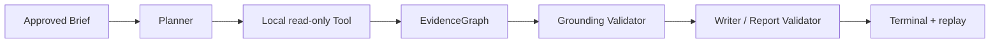

# DeepResearch 五分钟 Demo

默认 Demo 完全离线：它读取仓库中已冻结、脱敏的 GLM single-paper closure artifact，走同一个 FastAPI job 持久化与 SSE 读取入口，不构造在线 client，也不需要 API Key。



## 启动

```powershell
$env:PYTHONPATH = "src"
python -m uvicorn litflow_api.app:app --host 127.0.0.1 --port 8015
```

创建离线任务：

```powershell
$job = Invoke-RestMethod http://127.0.0.1:8015/api/deep-research/jobs -Method Post -ContentType 'application/json' -Body '{"query":"Explain the frozen demo result"}'
$jobId = $job.job_id
Invoke-RestMethod "http://127.0.0.1:8015/api/deep-research/jobs/$jobId"
Invoke-RestMethod "http://127.0.0.1:8015/api/deep-research/jobs/$jobId/result"
curl.exe "http://127.0.0.1:8015/api/deep-research/jobs/$jobId/events"
```

返回内容包含 run/provider/model、阶段状态、Planner/Tool/Writer 计数、Evidence/Claim/Citation 数量、grounding、token/cost/elapsed、artifact 相对定位和 replay 外部调用数。`publication_ready` 始终保守为 false。

## 入口与边界

- API：`POST /api/deep-research/jobs`、`GET /api/deep-research/jobs/{job_id}`、`GET .../result`、`GET .../events`。
- `/api/v1/*` 保留原有 MVP QA job；DeepResearch Demo 不创建第二套 Runtime。
- `mode=online` 会被明确拒绝；真实 Provider 仍只能通过已有受控 CLI、run 授权和环境变量完成。
- 浏览器和 API 不接受 Key；不返回 Authorization、原始 Provider 响应、reasoning、私人路径或论文全文。

## 讲解顺序

README → DeepResearch 架构 → 本 Demo → Evidence/Citation grounding → R1 指标 → Round 5 Provider closure。
