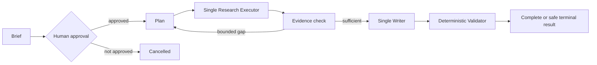

# DeepResearch Target Architecture

## Status and isolation

This document began as the S03/S04 target-architecture freeze. The bounded B01-B08 path is now implemented in `src/litflow/deep_research/`, with retained artifacts under `outputs/deep_research/`. The verified scope covers deterministic contracts and runtime, local read-only retrieval, one structured Planner, one structured Writer, grounding validation, and limited real GLM text-only pilots. LangGraph orchestration, Web, VLM, Multi-Agent, and production service integration remain unimplemented. Frozen MVP/M8 code and historical outputs remain isolated and unchanged.

| Layer | Current responsibility | Implementation evidence | Explicit non-ownership |
| --- | --- | --- | --- |
| Domain Contracts | versioned task, brief, approval, subtask, source, evidence, claim, citation, state and result contracts | B01/B04 Pydantic contracts and byte-stable schemas | no provider calls, retrieval, or final display authority |
| Deterministic Kernel | IDs, hashes, budget, transition guards, grounding, coverage, terminal safe failure and replay | B02/B03R/B03R2 runtime, B05 EvidenceGraph, B06 assessment and B07 validator | no model-owned identity or semantic-correctness claim |
| Orchestration | controlled single-Planner -> local Executor -> single-Writer flow | B04-B08 controlled runners and immutable pilot plans | no LangGraph dependency in the DeepResearch path; no Multi-Agent scheduling |
| Provider/Tool Adapters | GLM text-only Planner/Writer transport and local read-only BM25 passage tools | Gate A and bounded single-paper/cross-paper/abstention pilots | no Web/VLM transport, policy bypass, or direct report publication |

## Default Single-Agent control flow



The logical terminal outcomes are `complete`, `insufficient_evidence`, `failed`, and `cancelled`. A replan has explicit count, provider-token, tool-call and wall-time limits. Validator failure cannot be overridden by model self-assessment. Multi-Agent, if ever admitted, replaces only the Research Executor; it cannot replace the Evidence Kernel or Single Writer.

## Evidence ownership and context view

The program creates and owns Source, Evidence, Claim and Citation identity; it also owns provenance, original spans/regions, validation and final display authority. Models can return candidate plans, queries, claims, relations and repair suggestions only.

**Evidence Store** is the durable, complete provenance record. **Model Context View** is a budgeted, selected view derived from the Store for one model call. It is never a source of truth and cannot replace evidence identity. B01/B05 implement the current text Source/Evidence contracts; future Web and page+bbox evidence remain deferred and must preserve the same ownership rule.

## Artifact and persistence contract

Current persistence uses versioned JSON/JSONL, atomic checkpoints, append-only events and hash-verified replay. SQLite remains deferred to S39 unless evidence shows file contracts cannot meet recovery/concurrency needs.

```text
outputs/deep_research/<pilot-family>/<version>/<run_id>/
  runtime.jsonl, checkpoint.json
  validated_plan.json, evidence_graph.json, assessment.json
  validation_result.json
```

The repository retains immutable bounded-pilot artifacts for Gate A, single-paper E2E, source-scoped cross-paper comparison, and obvious out-of-domain abstention. These results validate only their frozen local-corpus scopes; they do not establish semantic correctness at scale, open-domain retrieval, Web, multimodal, Multi-Agent, or remote exactly-once behavior. M8 durable events remain a separate experimental lineage and do not validate the DeepResearch runtime.
