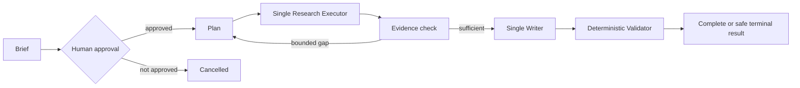

# DeepResearch Target Architecture

## Status and isolation

This is a planned architecture, not an implemented runtime. Future code belongs in `src/litflow/deep_research/`; future artifacts belong in `outputs/deep_research_v1/`. Neither namespace is created by this batch. Frozen MVP/M8 code and historical outputs remain unchanged and are reached only through adapters or wrappers.

| Layer | Planned responsibility | Existing reuse evidence | Explicit non-ownership |
| --- | --- | --- | --- |
| Domain Contracts | versioned task, brief, source, evidence, claim, citation, state and result contracts | existing Pydantic/dataclass/TypedDict assets A02–A16 | no provider calls, retrieval, display or schema invention in this batch |
| Deterministic Kernel | IDs, hashes, budget, transition guards, grounding, coverage, terminal safe failure | BM25/qrels checks, QA validation, span mapper, durable-event projection | no model planning or graph scheduling |
| Orchestration Adapter | LangGraph node scheduling, checkpoint integration and conditional routing | M8 `ResearchAgent` StateGraph and fake durable tests | no source/evidence identity, validator authority or final display authority |
| Provider/Tool Adapters | local retrieval, future LLM/Web/VLM transport behind replaceable seams | existing BM25, translation, QA and tool contracts | no policy bypass or direct report publication |

## Default Single-Agent control flow



The logical terminal outcomes are `complete`, `insufficient_evidence`, `failed`, and `cancelled`. A replan has explicit count, provider-token, tool-call and wall-time limits. Validator failure cannot be overridden by model self-assessment. Multi-Agent, if ever admitted, replaces only the Research Executor; it cannot replace the Evidence Kernel or Single Writer.

## Evidence ownership and context view

The program creates and owns Source, Evidence, Claim and Citation identity; it also owns provenance, original spans/regions, validation and final display authority. Models can return candidate plans, queries, claims, relations and repair suggestions only.

**Evidence Store** is the durable, complete provenance record. **Model Context View** is a budgeted, selected view derived from the Store for one model call. It is never a source of truth and cannot replace evidence identity. Text, future Web and future page+bbox evidence share this upper ownership rule; exact S05/S06 fields are deliberately deferred.

## Artifact and persistence contract

Initial persistence is versioned JSON/JSONL with atomic writes and append-only events. SQLite is deferred to S39 unless evidence shows file contracts cannot meet recovery/concurrency needs.

```text
outputs/deep_research_v1/runs/<run_id>/
  run_manifest.json, brief.json, plan.json, events.jsonl, checkpoints/
  sources.jsonl, evidence.jsonl, claims.jsonl, report.json, metrics.json
  failure.json  # failure only
```

Each artifact path is planned. No output is created by this batch. Existing M8 durable events are a wrapper candidate: v2 fake replay passed, while the real AG01 chain ended with `quote_grounding_failed / evidence_anchor_not_found` and therefore does not validate grounded completion.
