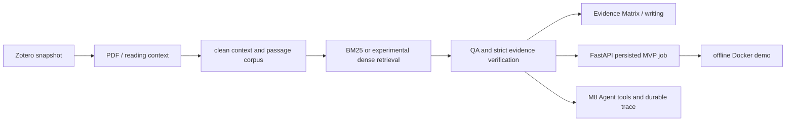

# LitFlow Asset Map for DeepResearch

## Audit scope and evidence rule

This is a read-only DR-S01 inventory of the repository at `afccfb5ad200d284d831cee0cddf43d4271631eb` (the S00 HEAD). It records existing code, tests, documents, and shallow artifact identities; it does not create a new runtime design or claim a new experiment. Asset IDs and their primary evidence are machine-readable in [asset_inventory.json](asset_inventory.json) and summarized per capability in [TRACEABILITY_MATRIX.md](TRACEABILITY_MATRIX.md).

`verified_in_code` means a symbol and its local call path were inspected. `verified_by_test` means focused tests exist, not that a provider E2E ran. `verified_by_artifact` means an immutable-looking output identity/summary was inspected. Historical documents retain their stated scope.

## Repository entry tree

```text
pyproject.toml                         package and pytest entry configuration
src/litflow/cli.py                     CLI command dispatcher
src/litflow/{zotero,pdf,context}/      local-paper intake and page/chunk provenance
src/litflow/{rag,llm}/                 corpus, retrieval, QA, grounding, replay
src/litflow/{evidence_matrix,evidence_writing}.py
src/litflow/{evaluation*,agent}/       evaluation and M8 experimental control plane
src/litflow/obsidian/                  preview, guarded apply, backups
src/litflow_api/                       FastAPI, persisted MVP jobs, static UI
tests/                                 deterministic, fake, replay, and API tests
outputs/                               frozen pilot/demo/trace artifacts
```



Each node is backed by one or more asset IDs in the following 12-domain map; the diagram is descriptive of existing paths, not a claim that M8 reached a grounded end-to-end completion.

## Capability map

| Domain | Asset IDs | Existing evidence | Candidate disposition | Boundary / gap |
| --- | --- | --- | --- | --- |
| 1. Zotero / Better BibTeX | `A02` | `zotero/client.py`, `collection_reader.py`, `diagnostics.py`; `test_zotero_reader.py` | `wrap_with_new_contract` | Local read/snapshot only; DeepResearch source identity needs a new domain contract. |
| 2. PDF, clean context, provenance | `A03` | `pdf/extractor.py`, `reading_context.py`, `context/models.py`, cleaner/chunker/quality gate tests | `wrap_with_new_contract` | Text/page/chunk provenance exists; layout regions/bbox and multimodal objects are not present. |
| 3. Obsidian preview/apply/backup | `A04` | `obsidian/update_preview.py`, `apply_update.py`, `writer.py`; apply/preview tests | `reference_only` | Explicit user-facing local-note operation, not a DeepResearch execution output path. |
| 4. Passage corpus and qrels | `A05` | `rag/bm25.py:build_corpus`, `rag/qrels.py`; frozen corpus/query manifests and qrels tests | `reuse_as_is` | Frozen MVP corpus/qrels are reference inputs, not a future DR benchmark split. |
| 5. BM25, Dense, Windowed, Hybrid, translation | `A06`, `A07`, `A08` | retrieval modules, deterministic tests, retrieval metrics artifacts | `reuse_as_is` for BM25; `reference_only` for Dense/Hybrid; `wrap_with_new_contract` for translation | Dense/Hybrid are frozen comparison results, not default retrieval; translation needs explicit provider approval for live use. |
| 6. Evidence-grounded QA and replay/review | `A09` | `rag/qa.py`, strict QA tests, `evidence_qa_v1_2` ledgers/review packets | `wrap_with_new_contract` | Current QA is query-shaped; future report claims need a versioned evidence graph. |
| 7. Evidence candidates and span mapping | `A10` | `llm/evidence_candidates.py`, `llm/span_mapping.py`, anchored-candidate tests | `reuse_as_is` | Exact/normalized span recovery is reusable; it is not a multimodal region validator. |
| 8. Evidence Matrix and bilingual writing | `A11` | matrix/writing modules, tests, `evidence_matrix_v1`, `m4_writing_v1` | `wrap_with_new_contract` | Existing record IDs and validated citations can feed future writer packets; no DR report graph yet. |
| 9. Evaluation, manifest, checkpoint/resume | `A12` | evaluation modules/runner, CLI commands, Run 002 documentation | `wrap_with_new_contract` | Current pilot is development-only; held-out governance, task taxonomy, and DR metrics are absent. |
| 10. FastAPI, SSE, persisted jobs, UI | `A13` | `litflow_api/mvp.py`, `app.py`, `test_mvp_api.py` | `reference_only` | MVP service persists local QA jobs; it is not a DeepResearch job contract. |
| 11. Docker offline/online boundary | `A14` | `Dockerfile`, `compose.yaml`, Docker documentation and screenshot-only M6 artifact | `reference_only` | Offline default is verified in code/config; independent structured M6 runtime summary was not found. |
| 12. Agent scaffold, tools, durable events, M8 gate | `A15`, `A16`, `A21` | agent runtime/tools/durable modules, fake tests, M8 closure and trace artifacts | `wrap_with_new_contract` | Durable/fake control-plane evidence exists; AG01 grounded completion failed at quote grounding, so it remains `experimental_partial_pass`. |

## Schema and identity assets

| Asset | Form and identity boundary | Serialization / validator boundary |
| --- | --- | --- |
| Candidate selection (`A01`) | frozen dataclass `CandidatePaper`; DOI or normalized title dedupe key | `to_dict()` gives a versioned candidate-pool JSON object. |
| Zotero/PDF/context (`A02`, `A03`) | dataclasses and Pydantic `CleanPage` / `TextChunk`; `zotero_key`, `citation_key`, `chunk_id`, pages and annotation IDs are preserved | explicit `to_dict()` or Pydantic serialization; quality gate treats incomplete context as non-ready. |
| Corpus/qrels (`A05`) | JSON/JSONL contracts; passage IDs and query IDs are checked against frozen inputs | `validate_queries`, corpus hash/manifest and qrels import/freeze checks. |
| QA (`A09`) | Pydantic Raw/Verified citation and claim models; `passage_id`, `quote`, entity and coverage fields are program-validated | `_verify_v11` / `_verify_v12`, transport normalization, quote/entity/coverage ledgers. |
| Anchored reading (`A10`) | `SpanMapping`, evidence candidate records; program owns `chunk_id`, page range and final source substring | `map_verbatim_span` returns exact spans or safe failures; no model quote is accepted as final evidence by itself. |
| Deep-reading sidecar | Pydantic `DeepReadingSidecar`, `EvidenceRecord`, `SourcedValue` and cross-reference IDs | `extra=forbid`, evidence and component ID cross-reference validators; historical v0.3A, not a DR schema. |
| Agent (`A15`) | `ResearchAgentState` is a `TypedDict`; tool args are Pydantic models | policy gate, bounded config, trace/event projection and approval state are program-owned. |
| MVP API (`A13`) | Pydantic request models and `DemoAssets` dataclass | FastAPI request validation; public result projection does not replace QA validation. |

## Artifact and metric evidence

| Root | Read-only identity / summary evidence | Reuse assessment |
| --- | --- | --- |
| `A17` — `outputs/rag_bm25_v1` | corpus manifest, passages, human-reviewed query/qrels manifests, per-mode metrics and dense/windowed cache manifests | Frozen corpus/qrels and BM25 identity are reusable references; embeddings and Dense/Hybrid comparisons are historical reference only. |
| `A18` — `outputs/evidence_qa_v1_2` | run/batch manifests, results, validation reports, quote/entity/coverage ledgers, review packets, usage/failure taxonomy | Strong provenance/reference for future validator tests; no new provider claim is made here. |
| `A19` — `outputs/evidence_matrix_v1` / `outputs/m4_writing_v1` | matrix/writing manifests, records, claim/sentence ledgers, review packets and value checks | Reusable input shapes only after a new DR contract wrapper. |
| `A20` — `outputs/m5_fastapi_v1` / `outputs/m6_docker_runtime` | persisted job identity files, UI screenshots/audits, and four Docker screenshots | MVP service/Docker presentation reference; no separate structured M6 runtime summary was found. |
| `A21` — `outputs/m8_agent` | fake durable validation manifest/events and canary run identities/results/usage | Preserve for failure-aware reuse only; durable-v2 fake replay passed, whereas real AG01 ended in `evidence_anchor_not_found`; M8 is not a passed end-to-end Agent baseline. |

The metric implementations are `rag/bm25.py:_metrics`, `rag/dense.py:evaluate_retriever`, `rag/windowed.py:evaluate_windowed`, `rag/qa.py:evaluate_qa` / `evaluate_qa_v12_batch`, `evaluation.py:compare_evidence_notes`, `evaluation_runner.py`, and `agent/evaluation.py`. Retrieval averages only the 17 `expected_answerable=true` queries (three no-answer queries are separate); `_metrics` records Hit@1, Recall@k, MRR@10 and nDCG@10. The human-reviewed v1.1 closure selected BM25-ZH-raw at Recall@10 `0.627451` and nDCG@10 `0.416270`; preliminary AI-drafted-silver outputs are not interchangeable with that closure. The frozen QA pilot reports 9/17 answerable grounded successes, 9/9 reviewed displayed answers and 3/3 no-answer handling; this is a historical pilot result, not an S01 rerun. No cross-pilot comparison is implied.

## Observed candidates and gaps (not ADR decisions)

- **Reuse as-is:** BM25 corpus construction/search, qrels identity checks, and conservative span mapping have bounded local evidence.
- **Wrap with a new contract:** Zotero/PDF provenance, QA results, Evidence Matrix/writing records, evaluation manifests, and durable events have useful mechanics but do not yet implement the DeepResearch target types.
- **Reference only / avoid default path:** local Obsidian mutation flow, MVP API/Docker presentation, and Dense/Hybrid frozen comparisons should not become the default DeepResearch path merely because code/artifacts exist.
- **New capability required:** Research Brief, versioned Source/EvidenceUnit/Claim graph, state-machine contract, task-level held-out protocol, Web source adapters/safety, PDF page-region evidence, and conditional Multi-Agent/Critic experiments.
- **S02 candidate:** `numpy` is imported by dense/windowed code and tests but absent from `requirements.runtime.lock`; reading-context tests use `pytest.importorskip("fitz")`, while the runtime lock has `pypdf` but no explicit PyMuPDF declaration. `torch` and `transformers` are delayed imports inside Dense `_Encoder`, so they are not established MVP runtime requirements.
- **Docker boundary caveat:** the default service declares a read-only root filesystem, but the explicit online profile does not repeat that declaration. This is an observed configuration asymmetry, not an S01 Docker test or fix.
- **Document drift:** root README says `238 passed`; the freshly reproduced S00/S01 contract is `268 passed, 1 warning`. Duration is non-contractual run variance.
