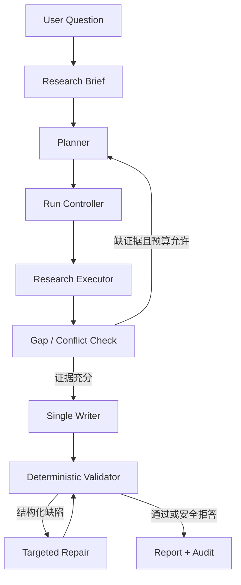
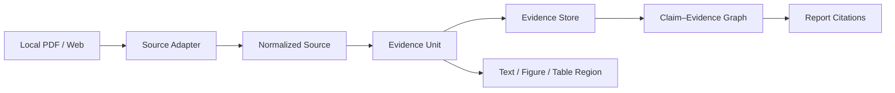

# LitFlow DeepResearch 长期演进路线图 v1

> 文档用途：这是后续交给 Codex 逐 Session 实施的总控文档。本版只冻结方向、阶段、边界和验收门槛；每个 Session 的详细执行单将在开始前单独编写。

## 0. 一句话决策

不另起炉灶复制一个通用 Multi-Agent Demo，而是在已验证的 LitFlow 证据内核上，演进出一个：

**面向工程论文与复杂技术调研的 Evidence-First、可评测、可恢复、支持多模态证据的 DeepResearch Agent。**

项目最终应该证明的不是“用了多少 Agent 框架名词”，而是：

1. 能把开放问题分解为可执行研究计划；
2. 能从本地论文与 Web 来源收集、去重、验证证据；
3. 能基于页码、段落和图表区域生成可追溯结论；
4. 能发现证据缺口、冲突和失败并受控重规划；
5. 能被重放、暂停、恢复、评测，并量化质量、成本和延迟；
6. 只有在等预算实验确实获益时，才保留 Multi-Agent 或 Critic 结构。

---

## 1. 当前起点与冻结边界

### 1.1 已有资产

- LitFlow v1.0 MVP：Zotero / PDF → Clean Context → Passage Corpus → 中英文检索 → Evidence-grounded QA → Evidence Matrix → 双语草稿 → FastAPI/SSE/UI → Docker Offline Demo。
- 冻结语料：10 papers / 185 passages。
- 冻结 qrels：20 条 human-reviewed queries。
- 正式本地测试：268 passed，1 warning。
- 已有严格 quote grounding、citation membership、entity binding、fail-closed、checkpoint、resume、失败 artifact。
- M8 已证明 durable event/replay 和受控工具链可行，但真实 AG01 最终因 `evidence_anchor_not_found` 被安全拒绝；整体仅可表述为 `experimental_partial_pass`。

### 1.2 不可覆盖的历史

- 不移动、删除或重建 `v1.0.0-mvp` 标签。
- 不覆盖已有 `outputs/`、corpus、qrels、evaluation、M8 trace。
- 不把 M8 历史失败改写为已完成 Agent 能力。
- 不为了新路线放宽旧 Validator、quote grounding 或 safe failure。
- 新阶段必须使用独立分支、版本化 schema、版本化 output 路径和新 release tag。

### 1.3 建议的新命名空间

- 长期路线代号：`DR`（DeepResearch Track）。
- 建议开发分支：`milestone/litflow-deepresearch-v1`。
- 新文档目录：`docs/deep_research/`。
- 新 artifact 根目录：`outputs/deep_research_v1/`。
- 新配置命名空间：`LITFLOW_DR_*`。
- 后续版本建议：
  - `v1.1`：可靠 Single-Agent Deep Research；
  - `v1.2`：评测、上下文工程、可观测服务；
  - `v1.3`：多模态论文证据；
  - `v1.4`：经实验验证的 Multi-Agent / Critic（如未获益则不发布）；
  - `v2.0`：可复现 Portfolio Release。

---

## 2. 目标用户、任务与产品边界

### 2.1 目标用户

- 需要调研工程论文、技术方案和实验结果的研究生或研发工程师；
- 需要对比多篇论文、定位证据、生成技术综述初稿的用户；
- 需要从 PDF 图、表、公式与正文联合取证的视觉/多模态研究用户。

### 2.2 核心任务

输入一个复杂研究问题和边界条件，系统产出：

- 可编辑的 Research Brief；
- 分解后的研究子问题与执行计划；
- 来源清单、Evidence Units、Claim–Evidence Graph；
- 冲突、证据缺口与不确定性；
- 带可点击引用的结构化研究报告；
- 完整执行轨迹、成本、延迟、失败与评测结果。

### 2.3 明确非目标

- 不做无限领域、无限浏览、无人监管的“全自动研究员”；
- 不以 Agent 数量、状态数量或框架堆叠作为成果；
- 不在可靠 Single-Agent 基线前构建复杂 Multi-Agent；
- 不把 LLM-as-Judge 当作唯一评测；
- 不把模型生成的 quote、citation 或来源身份直接视为事实；
- 不在没有消融实验时宣称压缩、记忆、Critic 或 Multi-Agent 有效；
- 不把本项目包装成模型预训练、SFT、RLHF 或算法研究项目。

---

## 3. 目标架构

### 3.1 控制面



初期 `Research Executor` 是单 Agent。只有 DR-7 的等预算实验通过，才将其替换为 Supervisor + 并行 Research Workers；`Writer` 仍保持单一，以避免多 Agent 合写造成结构破碎和重复。

### 3.2 数据面



### 3.3 职责边界

| 组件 | 模型可以做什么 | 程序必须拥有的权力 |
| --- | --- | --- |
| Planner | 提出子问题、搜索词、依赖关系 | schema 校验、预算、循环上限、任务 ID |
| Researcher | 选择工具、摘要、提出候选 claim | 来源身份、抓取缓存、去重、证据 ID、原文 span |
| Gap Checker | 判断缺口、冲突、下一步建议 | 最大 replan 次数、终止条件、可用工具范围 |
| Writer | 基于 Evidence Graph 综合写作 | citation 注入、claim coverage、禁止无证据事实 |
| Critic | 按错误类型提出结构化修复 | patch 白名单、收敛检测、成本上限、最终 validator |
| Multimodal Reader | 解释图表、生成候选区域与关系 | page/bbox、OCR 原文、区域哈希、跨模态 citation |

原则：**模型提出候选，程序拥有身份、边界、证据与最终展示权。**

---

## 4. 项目含金量的四条主线

### 主线 A：Agent Runtime 与可靠性

- 显式状态机，而不是一段循环 Prompt；
- durable event、checkpoint、resume、replay、cancel；
- token/time/tool-call 预算；
- timeout、retry、错误分类、动态 replan；
- Fake provider 与 deterministic E2E；
- 真实调用全部保留 manifest、轨迹和失败 artifact。

### 主线 B：Evidence-first Deep Research

- Local + Web 来源统一数据契约；
- Claim–Evidence Graph，而非只有最终回答；
- 来源质量、去重、冲突和时效性；
- citation membership、quote grounding、coverage、abstention；
- 单 Writer 基于审核过的证据合成报告。

### 主线 C：评测与实验方法

- dev / held-out 隔离；
- task-level、claim-level、citation-level、trajectory-level 指标；
- 规则评测 + 人审 + 受控 LLM-as-Judge；
- 相同模型、相同数据、相同预算下做消融；
- Bootstrap CI / effect size 只在样本量和设计允许时使用；
- 所有简历数字均能追溯到版本化 manifest。

### 主线 D：多模态工程论文证据

- PDF layout、页码、bbox、figure/table/formula 区域；
- OCR / caption / nearby text 联合索引；
- VLM 只读取选中的证据区域；
- 文本 claim 与图表单元、坐标、页码双向追溯；
- 建立 figure/table QA 专项 benchmark，与 text-only 基线对比。

这条主线是项目区别于通用 DeepResearch Demo、同时连接用户图像处理/深度学习背景的最佳差异点。

---

## 5. 全局质量指标与初始门槛

具体阈值应在首次正式 run 前冻结；以下是初始建议，禁止在看过 held-out 结果后反向修改。

| 类别 | 核心指标 | 初始门槛 |
| --- | --- | --- |
| Safety | 已展示引用有效率 | 100% |
| Safety | 已展示 claim evidence coverage | 100% |
| Safety | 无证据事实泄漏 | 0 |
| Reliability | deterministic Fake E2E | 100% 通过且可重放 |
| Reliability | 中断后恢复一致性 | 状态、预算、artifact 身份一致 |
| Research | answerable task grounded completion | 不低于冻结基线；每阶段需报告分母 |
| Abstention | no-answer / insufficient-evidence 判断 | 单独报告 precision/recall，不混入失败 |
| Context | 压缩后所需证据 recall | ≥ 95%，同时 token 至少下降 30% 才保留 |
| Efficiency | 每任务 token、provider calls、wall time | 全量记录，并与基线等条件比较 |
| Multimodal | page/bbox/citation 结构有效率 | 100% |
| Multimodal | 相比 text-only 的专项任务收益 | held-out 至少 +10pp，或经预注册统计门槛 |
| Multi-Agent | 相比 Single-Agent 的质量收益 | 等预算 held-out ≥ +5pp，或延迟显著降低且质量不降 |
| Multi-Agent | 成本约束 | 默认不超过 Single-Agent 1.5×；否则必须有明确质量收益 |
| Critic | 可修复错误下降 | 明显优于 no-critic，且不降低 grounding、不出现无界循环 |
| Human | 报告可用性 | 记录 pass/minor/major/reject，不以主观一句话代替 |

任何未达到门槛的实验均保留为负结果，不通过“调低 Validator”获得通过。

---

## 6. 路线总览

| Track | Sessions | 目标 | 阶段出口 |
| --- | ---: | --- | --- |
| DR-0 治理与可复现基线 | S00–S04 | 建立新里程碑、修复环境声明、冻结实验协议 | 新旧边界清晰，基线可一键复现 |
| DR-1 领域契约与 Runtime | S05–S10 | 定义状态、事件、任务、证据和预算 | Fake runtime 可确定性执行、暂停和恢复 |
| DR-2 可靠 Single-Agent | S11–S20 | 打通 plan→research→gap→write→validate | 真实 canary 出现可展示 grounded report |
| DR-3 Local + Web Research | S21–S25 | 统一本地和 Web 来源，建立质量与安全策略 | 受控 Web canary 通过 |
| DR-4 Evaluation v1 | S26–S32 | 自建 benchmark、指标、人审和 held-out | 有可复现基线与失败分布 |
| DR-5 Context / Service | S33–S41 | 压缩、预算、可观测 API、持久化和 Docker | 可演示、可恢复、可定位成本与失败 |
| DR-6 Multimodal Evidence | S42–S47 | 图表/公式/区域级证据与专项评测 | 多模态在 held-out 上证明增益 |
| DR-7 Conditional Multi-Agent | S48–S53 | 并行研究与动态 replan，对比 Single-Agent | 达门槛则保留，否则记录负结果并删除主路径依赖 |
| DR-8 Conditional Critic | S54–S57 | 错误类型驱动的结构化修复 | 达门槛才进入产品路径 |
| DR-9 Benchmark 与发布 | S58–S63 | 外部评测、provider 可移植、安全、演示与 release | 可复现 Portfolio Release |

建议投入：每周 10–15 小时，约 6–9 个月。前 32 个 Session 构成求职可用核心；DR-6 是差异化重点；DR-7/DR-8 是条件实验，不是必做装饰。

---

## 7. Session 目录

### DR-0：治理与可复现基线

| Session | 单一目标 | 主要交付物 | 完成门槛 |
| --- | --- | --- | --- |
| S00 | 创建 DeepResearch 新里程碑并冻结授权边界 | branch、目录约定、baseline manifest、ADR-000 | 旧 tag/outputs 未变；工作树 clean |
| S01 | 建立代码、schema、artifact 和指标资产地图 | `docs/deep_research/current_state.md` | 每个历史能力与证据路径可定位 |
| S02 | 单独修复 NumPy / PyMuPDF 依赖可复现性 | lock/extra 设计、安装与测试记录 | 新环境按文档安装后 268 tests 通过 |
| S03 | 冻结目标架构与关键 ADR | runtime、writer、evidence、multi-agent 决策 ADR | 组件职责与非目标无歧义 |
| S04 | 冻结实验与数据治理协议 | dev/held-out、manifest、命名、成本与审批规则 | 未经批准的真实调用和数据覆盖被禁止 |

### DR-1：领域契约与 Agent Runtime

| Session | 单一目标 | 主要交付物 | 完成门槛 |
| --- | --- | --- | --- |
| S05 | 定义 ResearchTask / Brief / Subtask schema | Pydantic models、JSON schema、测试 | 非法状态 fail closed |
| S06 | 定义 Source / EvidenceUnit / Claim / Citation schema | 统一文本与未来多模态字段 | provenance 身份不可由模型伪造 |
| S07 | 定义 RunState 和显式状态机 | 状态转换表、transition guards | 非法转移可测试并拒绝 |
| S08 | 扩展 durable event / checkpoint / replay | append-only events、snapshot、replay tests | 任意中断点可恢复一致状态 |
| S09 | 建立预算、超时、取消与 retry policy | BudgetLedger、error taxonomy | 不发生无限循环或重复扣费 |
| S10 | 建立 Fake provider 与 Fake tools E2E harness | deterministic scenarios、golden traces | success/abstain/timeout/replan 全可重放 |

### DR-2：可靠 Single-Agent Deep Research

| Session | 单一目标 | 主要交付物 | 完成门槛 |
| --- | --- | --- | --- |
| S11 | 实现 Research Brief 生成与人工确认 | scope、deliverable、constraints、success criteria | 未确认 brief 不进入真实执行 |
| S12 | 实现结构化 Planner | DAG/依赖、query intent、预算估计 | schema、循环、任务数均受控 |
| S13 | 实现本地论文 Research Executor | 复用 BM25/translation/QA，不改冻结内核 | 工具结果进入标准 EvidenceUnit |
| S14 | 实现 Claim–Evidence Graph | claim、support、contradict、uncertain edges | 每条可展示 claim 可回溯证据 |
| S15 | 实现 Evidence Gap / Conflict Checker | gap types、conflict records、next-action proposal | 只建议 replan，不直接突破预算 |
| S16 | 实现受控 replan | 最大轮次、增量任务、重复检测 | 可证明终止，重复 query 被拦截 |
| S17 | 实现 Single Writer | section plan、evidence packets、citation placeholders | Writer 不访问未授权原始上下文 |
| S18 | 实现 Report Validator 与 safe output | claim coverage、citation、entity、quote、structure | 未通过内容不可展示为答案 |
| S19 | 运行固定真实 canary 并保留全部 artifact | plan/manifest/events/evidence/report/metrics | 至少一个完整 grounded report；否则分类失败 |
| S20 | 对 canary 失败做根因审计与一次硬化 | failure audit、targeted fix、before/after | 不放宽 validator，不无界调参 |

### DR-3：Local + Web Research

| Session | 单一目标 | 主要交付物 | 完成门槛 |
| --- | --- | --- | --- |
| S21 | 定义 Search / Fetch provider 抽象 | provider-neutral request/response、fixtures | 切换 provider 不改变领域 schema |
| S22 | 实现抓取、净化、缓存和内容哈希 | cache、canonical URL、dedupe | 同一来源不重复调用；原文可追溯 |
| S23 | 建立来源质量与安全策略 | domain policy、时间、作者、注入防护、robots/terms 记录 | 不可信内容不能覆盖系统指令或身份字段 |
| S24 | 实现 Local / Web 路由与跨来源去重 | routing policy、source merge、conflict flag | 本地优先策略和 Web 补证据可解释 |
| S25 | 运行 Web canary | 受控任务、网络 manifest、成本与来源审计 | 引用可访问、内容哈希稳定、无未记录调用 |

### DR-4：Evaluation v1

| Session | 单一目标 | 主要交付物 | 完成门槛 |
| --- | --- | --- | --- |
| S26 | 定义 benchmark taxonomy 与首批任务 | 领域、难度、answerable/no-answer、多跳、时效类型 | 任务来源与答案依据可审计 |
| S27 | 建立 dev / held-out 数据与冻结流程 | versioned dataset、hash、review log | held-out 在冻结前不参与调参 |
| S28 | 实现 deterministic metrics | citation/coverage/grounding/abstention/trajectory | 指标有单元测试和边界用例 |
| S29 | 实现成本、延迟与工具轨迹指标 | token/call/time/retry/cache/replan | 每次 run 均自动落盘 |
| S30 | 生成人审 packet 与 rubric | blind packet、pass/minor/major/reject | 评审不依赖内部实现细节 |
| S31 | 运行 Single-Agent dev baseline | frozen config、summary、per-task artifacts | 报告分母、置信区间适用性和失败分布 |
| S32 | 冻结并运行第一次 held-out | pre-registration、immutable manifest、结果报告 | 不在看结果后改阈值；失败保留 |

### DR-5：Context Engineering、服务与可观测性

| Session | 单一目标 | 主要交付物 | 完成门槛 |
| --- | --- | --- | --- |
| S33 | 区分 Evidence Store 与 Model Context View | context packet schema、权限边界 | 截断不会破坏原始证据身份 |
| S34 | 实现预算感知证据选择基线 | relevance/diversity/source quota | 与全量上下文对比可复现 |
| S35 | 实现可选分层压缩实验 | extractive→structured→source excerpt | 不改原始证据；可逆映射 |
| S36 | 做 context recall / token 消融 | no-compress、selection、compression | recall ≥95% 且 token ↓30% 才保留 |
| S37 | 定义 DeepResearch FastAPI job contract | create/status/cancel/resume/result | API schema 版本化且权限明确 |
| S38 | 实现 SSE trace、阶段进度与取消 | typed events、backpressure、client disconnect | 断开不破坏 run，可继续查询 |
| S39 | 实现 run persistence 与进程重启恢复 | SQLite 起步、migration、recovery tests | 服务重启后 run 可恢复/终止 |
| S40 | 实现可观测页面 | plan、sources、evidence、claims、cost、failures | 用户可从结论点回原始证据 |
| S41 | Docker / CI / smoke / release candidate | offline default、online explicit、CI matrix | clean machine 一键启动并通过 smoke |

### DR-6：多模态工程论文证据

| Session | 单一目标 | 主要交付物 | 完成门槛 |
| --- | --- | --- | --- |
| S42 | 定义 PDF page-region 与 layout schema | page、bbox、region type、hash、reading order | 兼容已有 text EvidenceUnit |
| S43 | 抽取 figure/table/formula/caption/nearby text | parser adapter、region crops、OCR artifacts | 每个区域可回到 PDF 坐标 |
| S44 | 建立多模态检索与候选选择基线 | text-caption、OCR、region metadata 索引 | 不先依赖昂贵 VLM 全页读取 |
| S45 | 实现受控 VLM Region Reader | crop-only input、structured output、provider adapter | 模型不能修改 page/bbox/source identity |
| S46 | 实现跨模态 grounding validator | claim→region/cell/caption/page 验证 | 无效坐标、错页、无区域证据 fail closed |
| S47 | 构建专项 benchmark 并与 text-only 消融 | figure/table QA、review packet、held-out run | 达到预注册增益才进入正式能力 |

### DR-7：条件式 Multi-Agent 实验

| Session | 单一目标 | 主要交付物 | 完成门槛 |
| --- | --- | --- | --- |
| S48 | 预注册 Multi-Agent 假设和失败模式 | RFC、适用任务、预算、对照组 | 未定义预期收益前不写编排代码 |
| S49 | 实现 Supervisor + 隔离 Research Workers | subtask context、shared evidence store | Writer 仍单一；worker 无全局写权限 |
| S50 | 实现 asyncio + Semaphore 并发和配额 | concurrency、rate limit、cancel、timeout | 无泄漏 task；预算并发安全 |
| S51 | 实现失败感知 replan / 降级 | task timeout、batch failure、global deadline | 状态机覆盖且可确定性测试 |
| S52 | 做 Single vs Multi 等模型等预算消融 | paired runs、quality/cost/latency、failure analysis | 数据与配置完全可比 |
| S53 | 做保留/拒绝决策 | ADR、主路径选择、负结果报告 | 未达门槛则不把 Multi-Agent 放入默认产品路径 |

### DR-8：条件式 Critic / Repair 实验

| Session | 单一目标 | 主要交付物 | 完成门槛 |
| --- | --- | --- | --- |
| S54 | 从真实错误构建 Critic taxonomy | factual/citation/coverage/contradiction/structure | 每类错误有数据，不凭想象设计角色 |
| S55 | 实现结构化 Critique 与白名单 Patch | ADD/DELETE/MODIFY/VERIFY patch schema | Critic 不直接改 provenance 和原文证据 |
| S56 | 实现收敛、震荡和成本保护 | score history、patch hash、max rounds | 重复/反复 patch 自动停止 |
| S57 | 做 no-critic vs critic 消融 | 修复率、引入错误率、cost、latency | 只在净收益明确时保留 |

### DR-9：外部 benchmark、可移植性与发布

| Session | 单一目标 | 主要交付物 | 完成门槛 |
| --- | --- | --- | --- |
| S58 | 适配公开 Deep Research benchmark 子集 | adapter、license/data note、frozen subset | 不混淆内部 benchmark 与公开结果 |
| S59 | 完成 provider transport contract | OpenAI-compatible + 至少一个替代 backend | provider 切换不绕过 validator |
| S60 | 运行最终内外部评测 | reproducible commands、artifacts、tables | 所有数字有 commit/config/data/model identity |
| S61 | 做安全、隐私与故障演练 | prompt injection、SSRF、secret、PDF/web sandbox、threat model | 高风险路径默认拒绝或隔离 |
| S62 | 完成 README、架构、Demo、面试材料 | 3 分钟 demo、10 分钟技术讲解、failure story | 文档不夸大、不隐藏负结果 |
| S63 | Portfolio Release 与冻结 | release checklist、tag、model card/system card、final report | clean clone 可复现；旧 MVP 与新版本均可定位 |

---

## 8. 阶段 Gate 与止损规则

### Gate A：允许真实 Agent 调用（S10 后）

必须同时满足：

- Fake success/abstain/timeout/replan 全通过；
- budget、retry、cancel、checkpoint 有单测；
- 真实调用前生成 immutable plan/manifest；
- 用户明确批准 provider、模型、任务数和最大预算。

### Gate B：允许进入 Web Research（S20 后）

- Single-Agent 本地 canary 至少有一个完整 grounded report；
- quote/citation/coverage validator 未放宽；
- canary 失败已经被分类，不存在“偶尔成功但无法解释”。

### Gate C：允许进入 Multi-Agent（S47 后）

- Single-Agent held-out 基线已冻结；
- multimodal 或核心 evidence 路径已有稳定收益；
- 已识别可通过并行或上下文隔离解决的具体瓶颈；
- 没有“为了简历出现 Multi-Agent”这一理由。

### Gate D：Multi-Agent / Critic 保留条件

- 等模型、等数据、等预算或明确成本归一化；
- 预注册指标和阈值；
- held-out 改善且无 grounding safety 回归；
- 若失败，保留实验报告但移出默认路径。

### 全局止损

- 连续两个 Session 只能靠放宽 validator 才前进：立即停止并回到失败审计；
- 连续两个真实 run 没有新增诊断信息：停止 API 调用，补 Fake case 或观测字段；
- 新模块无法回答“解决哪个已观察失败、相对哪个 baseline”：不实现；
- 一项功能无法在简历中用“动作 + 策略 + 指标 + 边界”描述：暂不算阶段成果；
- 发现历史 output、tag 或 held-out 泄漏风险：停止当前 Session，先恢复治理边界。

---

## 9. Codex 单 Session 标准协议

### 9.1 Session 粒度

- 一个 Session 只解决一个可验收问题；
- 默认 1–4 小时，不把多个架构层混在一次提交；
- 每个 Session 从 clean worktree 开始，以测试、artifact、commit 和交接报告结束；
- 涉及真实网络、LLM 费用、删除、覆盖、迁移或 tag 时，必须先停在只读预检并请求确认。

### 9.2 每个详细 Session 必须包含

1. **目标**：本轮只要实现什么；
2. **为什么现在做**：依赖了什么，阻塞什么；
3. **只读预检**：分支、HEAD、status、相关文件、旧 artifact；
4. **允许修改**：精确到目录或文件类型；
5. **禁止修改**：冻结代码、schema、outputs、tag、真实 provider 等；
6. **实现任务**：按顺序列出，不允许顺手扩张；
7. **数据与 artifact**：输入、输出、版本、hash、失败产物；
8. **测试命令**：单测、专项、全量、lint 或 type check；
9. **验收标准**：可观察、可二元判断；
10. **停止条件**：失败后何时停止，不自动绕过；
11. **提交要求**：commit message、diff check、最终 status；
12. **交接格式**：做了什么、证据、风险、下一 Session 是否解锁。

### 9.3 可直接复用的 Codex Prompt 骨架

```text
你正在执行 LitFlow DeepResearch 路线中的 DR-SXX：<Session 名称>。

【唯一目标】
<一句话目标>

【当前已知基线】
- 仓库/分支/冻结 tag：...
- 上一 Session 交付物与 commit：...
- 本轮依赖的 schema/artifact：...

【先做只读预检】
1. 检查 AGENTS.md、git status、HEAD、相关文件与测试入口。
2. 报告发现与实施计划；若身份或边界不符，停止，不修改。

【允许修改】
- ...

【禁止修改】
- v1.0.0-mvp、历史 outputs、冻结 qrels/corpus/validator；
- 未列入范围的 Prompt、Retriever、API 和 M8 artifact；
- 未经批准的真实 LLM/Web 调用、删除、prune、tag 操作。

【实施任务】
1. ...
2. ...

【必须产出】
- 代码/测试：...
- 文档/schema：...
- artifact/manifest：...

【验证】
- 专项命令：...
- 全量命令：...
- git diff --check

【验收标准】
- ...

【停止条件】
- 一旦出现 ...，保留失败证据并停止，不放宽 validator，不顺手修复其他问题。

【收尾报告】
- 修改文件；测试与退出码；artifact 路径与 hash；commit；风险；是否解锁 DR-SXX+1。
```

### 9.4 Codex 交付报告不得只写“完成”

每次必须给出：

- Git 身份与工作树状态；
- 实际修改文件；
- 关键设计选择及被拒绝的替代方案；
- 测试命令、通过/跳过/失败数量；
- 新 artifact 路径、数据规模、hash；
- 是否调用外部服务及成本；
- 未解决风险和下一 Session 的前置条件；
- 对简历可用成果的状态：`not_ready / internal_result / heldout_validated / release_ready`。

---

## 10. 简历成果形成规则

每个阶段结束，不立即堆技术名词，而是生成一条可验证陈述：

> **做了什么系统能力** + **采用的关键策略** + **解决的真实失败** + **在什么数据和预算上获得什么指标** + **有什么边界**。

示例结构（数字必须来自未来正式 artifact，当前不可直接使用）：

```text
构建面向工程论文的 Evidence-First DeepResearch Agent，将规划、检索、证据图、缺口重规划、单写作者合成与确定性校验组织为可恢复状态机；在 N 个 held-out 任务上实现 X% grounded completion，已展示 claim 的引用与证据覆盖率均为 100%，并记录 token、延迟与失败轨迹。
```

多模态示例结构：

```text
设计 PDF 区域级多模态证据链，将图/表/公式的 page+bbox、caption、OCR 与正文 claim 统一为可追溯 EvidenceUnit；相较 text-only 基线，在 N 个图表问答 held-out 任务上提升 X pp，错误坐标与无依据引用均 fail closed。
```

只有通过 DR-S52/S53 的 Multi-Agent 才能写：

```text
通过 Supervisor + 隔离 Research Workers 和 asyncio/Semaphore 实现受预算约束的并行研究；在等模型、等预算的配对评测中，相较 Single-Agent 将 <指标> 提升/延迟降低 X%，成本为 X×。
```

若实验不通过，应写成工程判断或技术博客，不应硬塞入简历主项目描述。

---

## 11. 优先级与求职阶段成果

### 第一求职版本：完成 S00–S32

可对口：LLM 应用开发、Agent 应用、RAG/知识库后端。

必须能展示：可靠 Single-Agent、证据图、动态 replan、评测与真实失败审计。

### 第二求职版本：完成 S33–S47

可进一步对口：多模态应用、智能文档、科研 Copilot、视觉语言应用。

必须能展示：上下文消融、服务可观测、PDF 区域级多模态证据和 text-only 对照。

### 冲刺版本：完成并通过 S48–S63

可进一步对口：Agent 平台、复杂工作流编排、研究型 LLM 应用工程。

注意：S48–S57 未通过并不代表项目失败。一个能用数据拒绝无效 Multi-Agent/Critic 设计的项目，通常比一个堆角色但无基线的项目更可信。

---

## 12. 下一步

本总纲批准后，按顺序编写并执行：

1. `DR-S00：创建 DeepResearch 新里程碑并冻结授权边界`；
2. S00 完成并提交后，再生成 S01 的详细执行单；
3. 不一次把 64 个 Session 全交给 Codex 自动运行；每轮根据前一 Session 的真实结果更新后续细节，但不得偷偷改变总纲中的评测与冻结原则。

本路线图是“活的实施目录”，不是允许随意改指标的文档。架构可以根据证据调整，历史结果、held-out 边界和失败记录不可被重写。
